# Architecture Report

Generated by **CqrsLens 1.0.0** on 2026-11-07 00:00:00 UTC · text scanner · Source: `el-hakim`

## Overview

| Metric | Count |
| --- | ---: |
| Projects | 8 |
| Requests (commands + queries) | 63 |
| Handlers | 63 |
| Validators | 9 |
| Pipeline behaviors | 1 |
| DbContexts | 1 |
| Architecture checks | 0 error(s), 38 warning(s) |

## Configuration & Conventions

_The settings this scan ran under (declared) and what it found under them (actual). Declared values are the resolved configuration; actual values are the scan outcome._

### Declared

| Setting | Value |
| --- | --- |
| Config file | No config file found |
| Request markers | none declared |
| Handler markers | none declared |
| Layer overrides | none declared |
| Include globs | none declared |
| Exclude globs | none declared |
| Rule severity overrides | none declared |

### Actual

| Fact | Value |
| --- | --- |
| Layer-model status | asserted |
| Layer checks | Layer rules are asserted as errors. No layer findings. |
| Requests discovered | 63 |
| Conventions detected | none detected |

## Project Dependency Graph

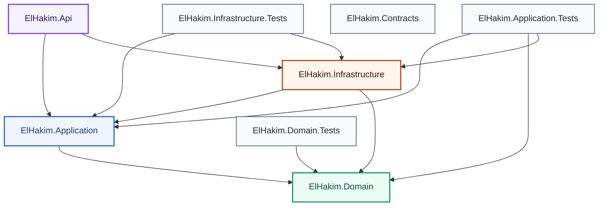
```mermaid
flowchart TD
    accTitle: Project dependency graph
    accDescr: 8 projects, 11 references.
    prj_ElHakim_Api["ElHakim.Api"]:::clsLayerApi
    prj_ElHakim_Application["ElHakim.Application"]:::clsLayerApplication
    prj_ElHakim_Application_Tests["ElHakim.Application.Tests"]:::clsLayerTests
    prj_ElHakim_Contracts["ElHakim.Contracts"]:::clsLayerOther
    prj_ElHakim_Domain["ElHakim.Domain"]:::clsLayerDomain
    prj_ElHakim_Domain_Tests["ElHakim.Domain.Tests"]:::clsLayerTests
    prj_ElHakim_Infrastructure["ElHakim.Infrastructure"]:::clsLayerInfrastructure
    prj_ElHakim_Infrastructure_Tests["ElHakim.Infrastructure.Tests"]:::clsLayerTests
    prj_ElHakim_Api --> prj_ElHakim_Application
    prj_ElHakim_Api --> prj_ElHakim_Infrastructure
    prj_ElHakim_Application --> prj_ElHakim_Domain
    prj_ElHakim_Application_Tests --> prj_ElHakim_Application
    prj_ElHakim_Application_Tests --> prj_ElHakim_Domain
    prj_ElHakim_Application_Tests --> prj_ElHakim_Infrastructure
    prj_ElHakim_Domain_Tests --> prj_ElHakim_Domain
    prj_ElHakim_Infrastructure --> prj_ElHakim_Application
    prj_ElHakim_Infrastructure --> prj_ElHakim_Domain
    prj_ElHakim_Infrastructure_Tests --> prj_ElHakim_Application
    prj_ElHakim_Infrastructure_Tests --> prj_ElHakim_Infrastructure
    classDef clsLayerDomain fill:#ecfdf5,stroke:#059669,stroke-width:2px,color:#064e3b
    classDef clsLayerApplication fill:#eff6ff,stroke:#2563eb,stroke-width:2px,color:#1e3a8a
    classDef clsLayerInfrastructure fill:#fff7ed,stroke:#c2410c,stroke-width:2px,color:#431407
    classDef clsLayerApi fill:#f5f3ff,stroke:#7c3aed,stroke-width:2px,color:#2e1065
    classDef clsLayerTests fill:#f8fafc,stroke:#64748b,stroke-width:1.5px,color:#1e293b
    classDef clsLayerOther fill:#f8fafc,stroke:#64748b,stroke-width:1.5px,color:#1e293b
```

**Layer colors:** green = Domain · blue = Application · amber = Infrastructure · purple = Api/Web/UI · gray = Tests/other.

## Layers

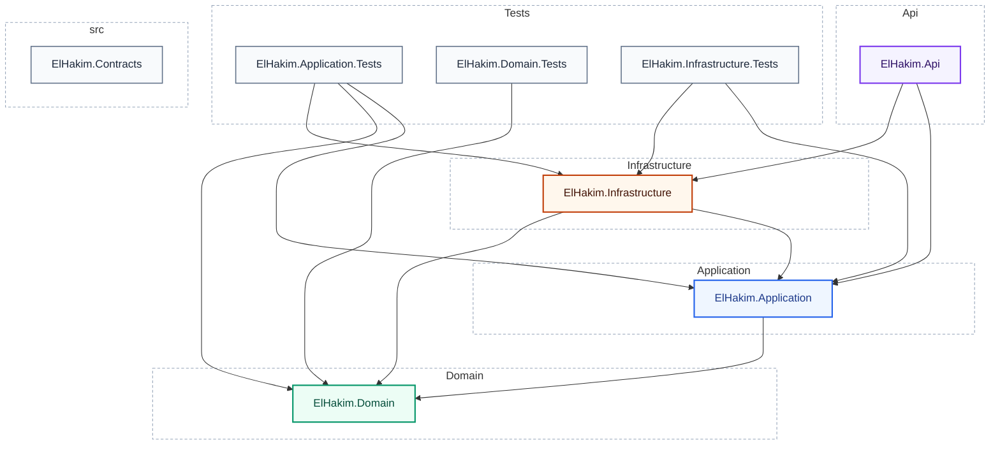
```mermaid
flowchart TD
    accTitle: Layer diagram
    accDescr: 8 projects, 6 layers, 11 references.
    subgraph lyr_Tests["Tests"]
        prj_ElHakim_Application_Tests["ElHakim.Application.Tests"]:::clsLayerTests
        prj_ElHakim_Domain_Tests["ElHakim.Domain.Tests"]:::clsLayerTests
        prj_ElHakim_Infrastructure_Tests["ElHakim.Infrastructure.Tests"]:::clsLayerTests
    end
    subgraph lyr_Api["Api"]
        prj_ElHakim_Api["ElHakim.Api"]:::clsLayerApi
    end
    subgraph lyr_src["src"]
        prj_ElHakim_Contracts["ElHakim.Contracts"]:::clsLayerOther
    end
    subgraph lyr_Infrastructure["Infrastructure"]
        prj_ElHakim_Infrastructure["ElHakim.Infrastructure"]:::clsLayerInfrastructure
    end
    subgraph lyr_Application["Application"]
        prj_ElHakim_Application["ElHakim.Application"]:::clsLayerApplication
    end
    subgraph lyr_Domain["Domain"]
        prj_ElHakim_Domain["ElHakim.Domain"]:::clsLayerDomain
    end
    prj_ElHakim_Api --> prj_ElHakim_Application
    prj_ElHakim_Api --> prj_ElHakim_Infrastructure
    prj_ElHakim_Application --> prj_ElHakim_Domain
    prj_ElHakim_Application_Tests --> prj_ElHakim_Application
    prj_ElHakim_Application_Tests --> prj_ElHakim_Domain
    prj_ElHakim_Application_Tests --> prj_ElHakim_Infrastructure
    prj_ElHakim_Domain_Tests --> prj_ElHakim_Domain
    prj_ElHakim_Infrastructure --> prj_ElHakim_Application
    prj_ElHakim_Infrastructure --> prj_ElHakim_Domain
    prj_ElHakim_Infrastructure_Tests --> prj_ElHakim_Application
    prj_ElHakim_Infrastructure_Tests --> prj_ElHakim_Infrastructure
    style lyr_Tests fill:none,stroke:#94a3b8,stroke-dasharray:4 3
    style lyr_Api fill:none,stroke:#94a3b8,stroke-dasharray:4 3
    style lyr_src fill:none,stroke:#94a3b8,stroke-dasharray:4 3
    style lyr_Infrastructure fill:none,stroke:#94a3b8,stroke-dasharray:4 3
    style lyr_Application fill:none,stroke:#94a3b8,stroke-dasharray:4 3
    style lyr_Domain fill:none,stroke:#94a3b8,stroke-dasharray:4 3
    classDef clsLayerDomain fill:#ecfdf5,stroke:#059669,stroke-width:2px,color:#064e3b
    classDef clsLayerApplication fill:#eff6ff,stroke:#2563eb,stroke-width:2px,color:#1e3a8a
    classDef clsLayerInfrastructure fill:#fff7ed,stroke:#c2410c,stroke-width:2px,color:#431407
    classDef clsLayerApi fill:#f5f3ff,stroke:#7c3aed,stroke-width:2px,color:#2e1065
    classDef clsLayerTests fill:#f8fafc,stroke:#64748b,stroke-width:1.5px,color:#1e293b
    classDef clsLayerOther fill:#f8fafc,stroke:#64748b,stroke-width:1.5px,color:#1e293b
```

_Dashed boundaries group projects into layers. Projects are grouped by Clean Architecture naming convention (Domain / Application / Infrastructure / Api / Web / UI); projects matching no convention are grouped by their top-level folder._

## CQRS Map

**Legend:** blue = command · teal = query · violet = other request · gray stadium = handler · amber = validator. Amber dashed request = `CommandWithoutValidator` finding.

_Requests are grouped by declaring project. Handler and validator nodes are shown where linked and may be declared in a different project._

_63 requests across 1 project. Diagrams are split by project and balanced so each stays within GitHub's rendering limits; every request appears exactly once._

### ElHakim.Application — 12 of 63 requests (part 1 of 6)

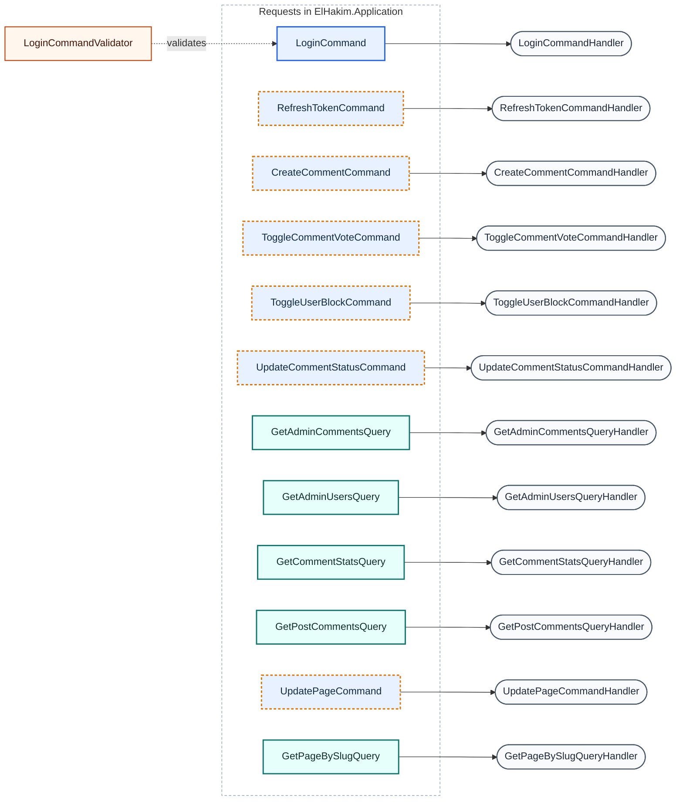
```mermaid
flowchart LR
    accTitle: CQRS map
    accDescr: 12 requests, 12 handlers, 1 validator, 6 CommandWithoutValidator.
    subgraph prj_ElHakim_Application["Requests in ElHakim.Application"]
        req_LoginCommand["LoginCommand"]:::clsCommand
        req_RefreshTokenCommand["RefreshTokenCommand"]:::clsCommandNoValidator
        req_CreateCommentCommand["CreateCommentCommand"]:::clsCommandNoValidator
        req_ToggleCommentVoteCommand["ToggleCommentVoteCommand"]:::clsCommandNoValidator
        req_ToggleUserBlockCommand["ToggleUserBlockCommand"]:::clsCommandNoValidator
        req_UpdateCommentStatusCommand["UpdateCommentStatusCommand"]:::clsCommandNoValidator
        req_GetAdminCommentsQuery["GetAdminCommentsQuery"]:::clsQuery
        req_GetAdminUsersQuery["GetAdminUsersQuery"]:::clsQuery
        req_GetCommentStatsQuery["GetCommentStatsQuery"]:::clsQuery
        req_GetPostCommentsQuery["GetPostCommentsQuery"]:::clsQuery
        req_UpdatePageCommand["UpdatePageCommand"]:::clsCommandNoValidator
        req_GetPageBySlugQuery["GetPageBySlugQuery"]:::clsQuery
    end
    hdl_LoginCommandHandler(["LoginCommandHandler"]):::clsHandler
    hdl_RefreshTokenCommandHandler(["RefreshTokenCommandHandler"]):::clsHandler
    hdl_CreateCommentCommandHandler(["CreateCommentCommandHandler"]):::clsHandler
    hdl_ToggleCommentVoteCommandHandler(["ToggleCommentVoteCommandHandler"]):::clsHandler
    hdl_ToggleUserBlockCommandHandler(["ToggleUserBlockCommandHandler"]):::clsHandler
    hdl_UpdateCommentStatusCommandHandler(["UpdateCommentStatusCommandHandler"]):::clsHandler
    hdl_GetAdminCommentsQueryHandler(["GetAdminCommentsQueryHandler"]):::clsHandler
    hdl_GetAdminUsersQueryHandler(["GetAdminUsersQueryHandler"]):::clsHandler
    hdl_GetCommentStatsQueryHandler(["GetCommentStatsQueryHandler"]):::clsHandler
    hdl_GetPostCommentsQueryHandler(["GetPostCommentsQueryHandler"]):::clsHandler
    hdl_UpdatePageCommandHandler(["UpdatePageCommandHandler"]):::clsHandler
    hdl_GetPageBySlugQueryHandler(["GetPageBySlugQueryHandler"]):::clsHandler
    val_LoginCommandValidator["LoginCommandValidator"]:::clsValidator
    req_LoginCommand --> hdl_LoginCommandHandler
    val_LoginCommandValidator -.->|validates| req_LoginCommand
    req_RefreshTokenCommand --> hdl_RefreshTokenCommandHandler
    req_CreateCommentCommand --> hdl_CreateCommentCommandHandler
    req_ToggleCommentVoteCommand --> hdl_ToggleCommentVoteCommandHandler
    req_ToggleUserBlockCommand --> hdl_ToggleUserBlockCommandHandler
    req_UpdateCommentStatusCommand --> hdl_UpdateCommentStatusCommandHandler
    req_GetAdminCommentsQuery --> hdl_GetAdminCommentsQueryHandler
    req_GetAdminUsersQuery --> hdl_GetAdminUsersQueryHandler
    req_GetCommentStatsQuery --> hdl_GetCommentStatsQueryHandler
    req_GetPostCommentsQuery --> hdl_GetPostCommentsQueryHandler
    req_UpdatePageCommand --> hdl_UpdatePageCommandHandler
    req_GetPageBySlugQuery --> hdl_GetPageBySlugQueryHandler
    style prj_ElHakim_Application fill:none,stroke:#94a3b8,stroke-dasharray:4 3
    classDef clsCommand fill:#e8f1ff,stroke:#2563eb,stroke-width:2px,color:#102a43
    classDef clsQuery fill:#e6fffa,stroke:#0f766e,stroke-width:2px,color:#0f2e2e
    classDef clsRequest fill:#f5f3ff,stroke:#6d28d9,stroke-width:2px,color:#2e1065
    classDef clsHandler fill:#f8fafc,stroke:#475569,stroke-width:1.5px,color:#1e293b
    classDef clsValidator fill:#fff7ed,stroke:#c2410c,stroke-width:1.5px,color:#431407
    classDef clsCommandNoValidator fill:#e8f1ff,stroke:#d97706,stroke-width:2px,stroke-dasharray:4 3,color:#102a43
```

_12 requests · 12 handlers · 1 validator · 6 CommandWithoutValidator findings_

### ElHakim.Application — 10 of 63 requests (part 2 of 6)

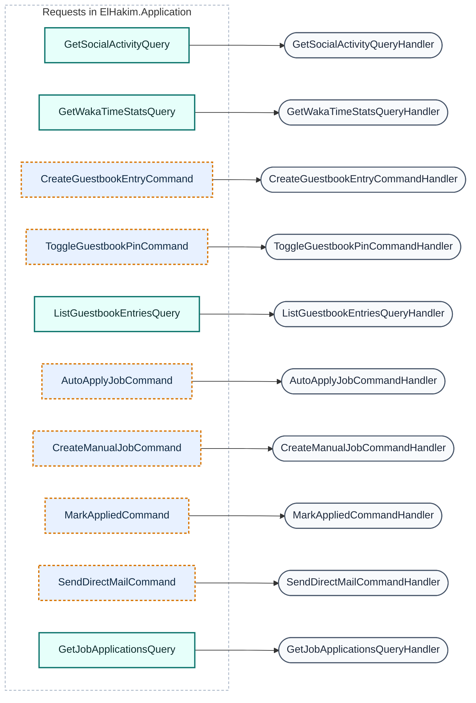
```mermaid
flowchart LR
    accTitle: CQRS map
    accDescr: 10 requests, 10 handlers, 0 validators, 6 CommandWithoutValidator.
    subgraph prj_ElHakim_Application["Requests in ElHakim.Application"]
        req_GetSocialActivityQuery["GetSocialActivityQuery"]:::clsQuery
        req_GetWakaTimeStatsQuery["GetWakaTimeStatsQuery"]:::clsQuery
        req_CreateGuestbookEntryCommand["CreateGuestbookEntryCommand"]:::clsCommandNoValidator
        req_ToggleGuestbookPinCommand["ToggleGuestbookPinCommand"]:::clsCommandNoValidator
        req_ListGuestbookEntriesQuery["ListGuestbookEntriesQuery"]:::clsQuery
        req_AutoApplyJobCommand["AutoApplyJobCommand"]:::clsCommandNoValidator
        req_CreateManualJobCommand["CreateManualJobCommand"]:::clsCommandNoValidator
        req_MarkAppliedCommand["MarkAppliedCommand"]:::clsCommandNoValidator
        req_SendDirectMailCommand["SendDirectMailCommand"]:::clsCommandNoValidator
        req_GetJobApplicationsQuery["GetJobApplicationsQuery"]:::clsQuery
    end
    hdl_GetSocialActivityQueryHandler(["GetSocialActivityQueryHandler"]):::clsHandler
    hdl_GetWakaTimeStatsQueryHandler(["GetWakaTimeStatsQueryHandler"]):::clsHandler
    hdl_CreateGuestbookEntryCommandHandler(["CreateGuestbookEntryCommandHandler"]):::clsHandler
    hdl_ToggleGuestbookPinCommandHandler(["ToggleGuestbookPinCommandHandler"]):::clsHandler
    hdl_ListGuestbookEntriesQueryHandler(["ListGuestbookEntriesQueryHandler"]):::clsHandler
    hdl_AutoApplyJobCommandHandler(["AutoApplyJobCommandHandler"]):::clsHandler
    hdl_CreateManualJobCommandHandler(["CreateManualJobCommandHandler"]):::clsHandler
    hdl_MarkAppliedCommandHandler(["MarkAppliedCommandHandler"]):::clsHandler
    hdl_SendDirectMailCommandHandler(["SendDirectMailCommandHandler"]):::clsHandler
    hdl_GetJobApplicationsQueryHandler(["GetJobApplicationsQueryHandler"]):::clsHandler
    req_GetSocialActivityQuery --> hdl_GetSocialActivityQueryHandler
    req_GetWakaTimeStatsQuery --> hdl_GetWakaTimeStatsQueryHandler
    req_CreateGuestbookEntryCommand --> hdl_CreateGuestbookEntryCommandHandler
    req_ToggleGuestbookPinCommand --> hdl_ToggleGuestbookPinCommandHandler
    req_ListGuestbookEntriesQuery --> hdl_ListGuestbookEntriesQueryHandler
    req_AutoApplyJobCommand --> hdl_AutoApplyJobCommandHandler
    req_CreateManualJobCommand --> hdl_CreateManualJobCommandHandler
    req_MarkAppliedCommand --> hdl_MarkAppliedCommandHandler
    req_SendDirectMailCommand --> hdl_SendDirectMailCommandHandler
    req_GetJobApplicationsQuery --> hdl_GetJobApplicationsQueryHandler
    style prj_ElHakim_Application fill:none,stroke:#94a3b8,stroke-dasharray:4 3
    classDef clsCommand fill:#e8f1ff,stroke:#2563eb,stroke-width:2px,color:#102a43
    classDef clsQuery fill:#e6fffa,stroke:#0f766e,stroke-width:2px,color:#0f2e2e
    classDef clsRequest fill:#f5f3ff,stroke:#6d28d9,stroke-width:2px,color:#2e1065
    classDef clsHandler fill:#f8fafc,stroke:#475569,stroke-width:1.5px,color:#1e293b
    classDef clsValidator fill:#fff7ed,stroke:#c2410c,stroke-width:1.5px,color:#431407
    classDef clsCommandNoValidator fill:#e8f1ff,stroke:#d97706,stroke-width:2px,stroke-dasharray:4 3,color:#102a43
```

_10 requests · 10 handlers · 0 validators · 6 CommandWithoutValidator findings_

### ElHakim.Application — 7 of 63 requests (part 3 of 6)

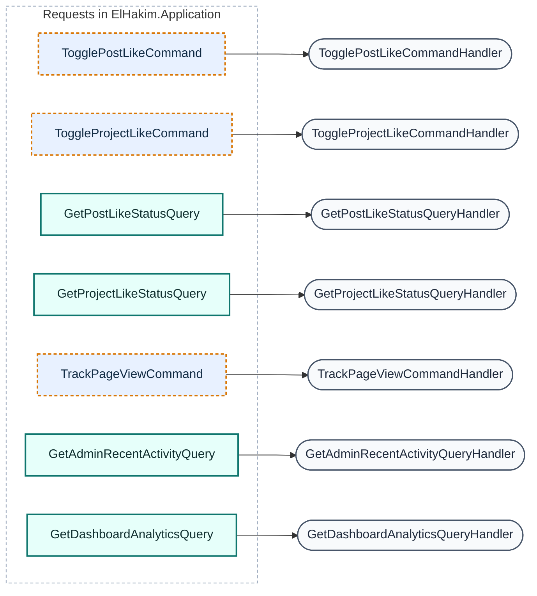
```mermaid
flowchart LR
    accTitle: CQRS map
    accDescr: 7 requests, 7 handlers, 0 validators, 3 CommandWithoutValidator.
    subgraph prj_ElHakim_Application["Requests in ElHakim.Application"]
        req_TogglePostLikeCommand["TogglePostLikeCommand"]:::clsCommandNoValidator
        req_ToggleProjectLikeCommand["ToggleProjectLikeCommand"]:::clsCommandNoValidator
        req_GetPostLikeStatusQuery["GetPostLikeStatusQuery"]:::clsQuery
        req_GetProjectLikeStatusQuery["GetProjectLikeStatusQuery"]:::clsQuery
        req_TrackPageViewCommand["TrackPageViewCommand"]:::clsCommandNoValidator
        req_GetAdminRecentActivityQuery["GetAdminRecentActivityQuery"]:::clsQuery
        req_GetDashboardAnalyticsQuery["GetDashboardAnalyticsQuery"]:::clsQuery
    end
    hdl_TogglePostLikeCommandHandler(["TogglePostLikeCommandHandler"]):::clsHandler
    hdl_ToggleProjectLikeCommandHandler(["ToggleProjectLikeCommandHandler"]):::clsHandler
    hdl_GetPostLikeStatusQueryHandler(["GetPostLikeStatusQueryHandler"]):::clsHandler
    hdl_GetProjectLikeStatusQueryHandler(["GetProjectLikeStatusQueryHandler"]):::clsHandler
    hdl_TrackPageViewCommandHandler(["TrackPageViewCommandHandler"]):::clsHandler
    hdl_GetAdminRecentActivityQueryHandler(["GetAdminRecentActivityQueryHandler"]):::clsHandler
    hdl_GetDashboardAnalyticsQueryHandler(["GetDashboardAnalyticsQueryHandler"]):::clsHandler
    req_TogglePostLikeCommand --> hdl_TogglePostLikeCommandHandler
    req_ToggleProjectLikeCommand --> hdl_ToggleProjectLikeCommandHandler
    req_GetPostLikeStatusQuery --> hdl_GetPostLikeStatusQueryHandler
    req_GetProjectLikeStatusQuery --> hdl_GetProjectLikeStatusQueryHandler
    req_TrackPageViewCommand --> hdl_TrackPageViewCommandHandler
    req_GetAdminRecentActivityQuery --> hdl_GetAdminRecentActivityQueryHandler
    req_GetDashboardAnalyticsQuery --> hdl_GetDashboardAnalyticsQueryHandler
    style prj_ElHakim_Application fill:none,stroke:#94a3b8,stroke-dasharray:4 3
    classDef clsCommand fill:#e8f1ff,stroke:#2563eb,stroke-width:2px,color:#102a43
    classDef clsQuery fill:#e6fffa,stroke:#0f766e,stroke-width:2px,color:#0f2e2e
    classDef clsRequest fill:#f5f3ff,stroke:#6d28d9,stroke-width:2px,color:#2e1065
    classDef clsHandler fill:#f8fafc,stroke:#475569,stroke-width:1.5px,color:#1e293b
    classDef clsValidator fill:#fff7ed,stroke:#c2410c,stroke-width:1.5px,color:#431407
    classDef clsCommandNoValidator fill:#e8f1ff,stroke:#d97706,stroke-width:2px,stroke-dasharray:4 3,color:#102a43
```

_7 requests · 7 handlers · 0 validators · 3 CommandWithoutValidator findings_

### ElHakim.Application — 11 of 63 requests (part 4 of 6)

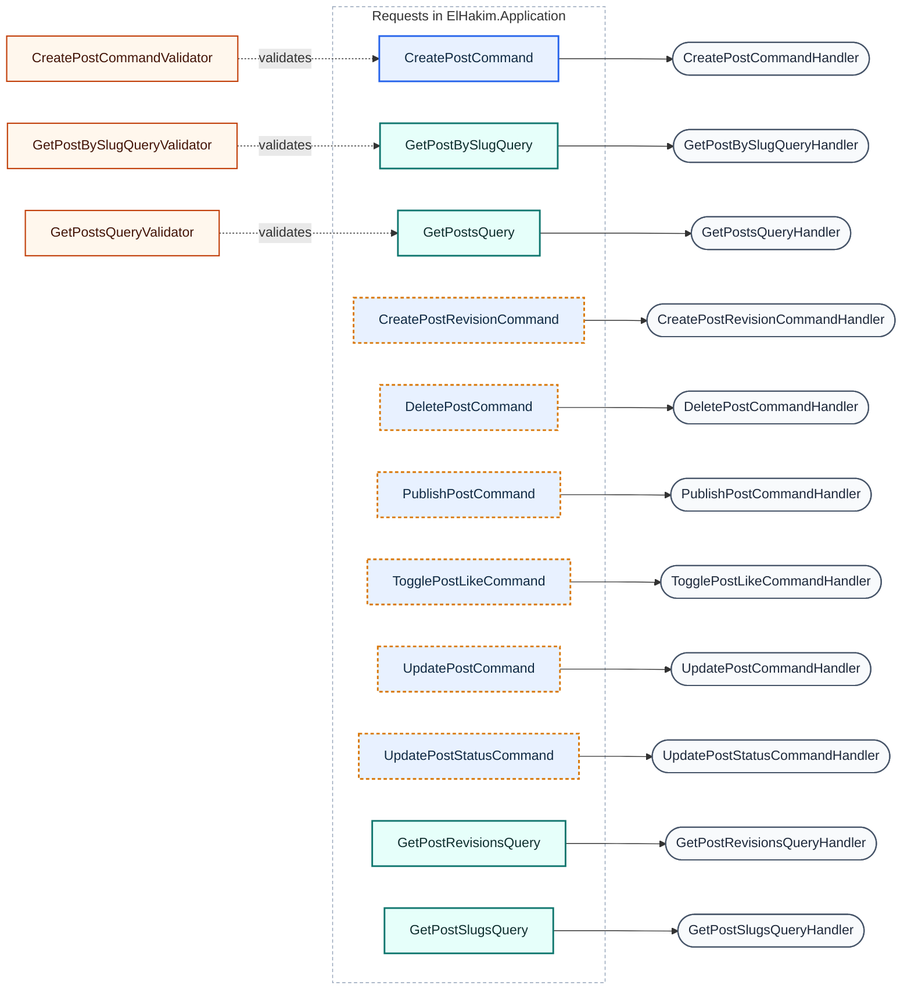
```mermaid
flowchart LR
    accTitle: CQRS map
    accDescr: 11 requests, 11 handlers, 3 validators, 6 CommandWithoutValidator.
    subgraph prj_ElHakim_Application["Requests in ElHakim.Application"]
        req_CreatePostCommand["CreatePostCommand"]:::clsCommand
        req_CreatePostRevisionCommand["CreatePostRevisionCommand"]:::clsCommandNoValidator
        req_DeletePostCommand["DeletePostCommand"]:::clsCommandNoValidator
        req_PublishPostCommand["PublishPostCommand"]:::clsCommandNoValidator
        req_TogglePostLikeCommand["TogglePostLikeCommand"]:::clsCommandNoValidator
        req_UpdatePostCommand["UpdatePostCommand"]:::clsCommandNoValidator
        req_UpdatePostStatusCommand["UpdatePostStatusCommand"]:::clsCommandNoValidator
        req_GetPostBySlugQuery["GetPostBySlugQuery"]:::clsQuery
        req_GetPostRevisionsQuery["GetPostRevisionsQuery"]:::clsQuery
        req_GetPostSlugsQuery["GetPostSlugsQuery"]:::clsQuery
        req_GetPostsQuery["GetPostsQuery"]:::clsQuery
    end
    hdl_CreatePostCommandHandler(["CreatePostCommandHandler"]):::clsHandler
    hdl_CreatePostRevisionCommandHandler(["CreatePostRevisionCommandHandler"]):::clsHandler
    hdl_DeletePostCommandHandler(["DeletePostCommandHandler"]):::clsHandler
    hdl_PublishPostCommandHandler(["PublishPostCommandHandler"]):::clsHandler
    hdl_TogglePostLikeCommandHandler(["TogglePostLikeCommandHandler"]):::clsHandler
    hdl_UpdatePostCommandHandler(["UpdatePostCommandHandler"]):::clsHandler
    hdl_UpdatePostStatusCommandHandler(["UpdatePostStatusCommandHandler"]):::clsHandler
    hdl_GetPostBySlugQueryHandler(["GetPostBySlugQueryHandler"]):::clsHandler
    hdl_GetPostRevisionsQueryHandler(["GetPostRevisionsQueryHandler"]):::clsHandler
    hdl_GetPostSlugsQueryHandler(["GetPostSlugsQueryHandler"]):::clsHandler
    hdl_GetPostsQueryHandler(["GetPostsQueryHandler"]):::clsHandler
    val_CreatePostCommandValidator["CreatePostCommandValidator"]:::clsValidator
    val_GetPostBySlugQueryValidator["GetPostBySlugQueryValidator"]:::clsValidator
    val_GetPostsQueryValidator["GetPostsQueryValidator"]:::clsValidator
    req_CreatePostCommand --> hdl_CreatePostCommandHandler
    val_CreatePostCommandValidator -.->|validates| req_CreatePostCommand
    req_CreatePostRevisionCommand --> hdl_CreatePostRevisionCommandHandler
    req_DeletePostCommand --> hdl_DeletePostCommandHandler
    req_PublishPostCommand --> hdl_PublishPostCommandHandler
    req_TogglePostLikeCommand --> hdl_TogglePostLikeCommandHandler
    req_UpdatePostCommand --> hdl_UpdatePostCommandHandler
    req_UpdatePostStatusCommand --> hdl_UpdatePostStatusCommandHandler
    req_GetPostBySlugQuery --> hdl_GetPostBySlugQueryHandler
    val_GetPostBySlugQueryValidator -.->|validates| req_GetPostBySlugQuery
    req_GetPostRevisionsQuery --> hdl_GetPostRevisionsQueryHandler
    req_GetPostSlugsQuery --> hdl_GetPostSlugsQueryHandler
    req_GetPostsQuery --> hdl_GetPostsQueryHandler
    val_GetPostsQueryValidator -.->|validates| req_GetPostsQuery
    style prj_ElHakim_Application fill:none,stroke:#94a3b8,stroke-dasharray:4 3
    classDef clsCommand fill:#e8f1ff,stroke:#2563eb,stroke-width:2px,color:#102a43
    classDef clsQuery fill:#e6fffa,stroke:#0f766e,stroke-width:2px,color:#0f2e2e
    classDef clsRequest fill:#f5f3ff,stroke:#6d28d9,stroke-width:2px,color:#2e1065
    classDef clsHandler fill:#f8fafc,stroke:#475569,stroke-width:1.5px,color:#1e293b
    classDef clsValidator fill:#fff7ed,stroke:#c2410c,stroke-width:1.5px,color:#431407
    classDef clsCommandNoValidator fill:#e8f1ff,stroke:#d97706,stroke-width:2px,stroke-dasharray:4 3,color:#102a43
```

_11 requests · 11 handlers · 3 validators · 6 CommandWithoutValidator findings_

### ElHakim.Application — 13 of 63 requests (part 5 of 6)

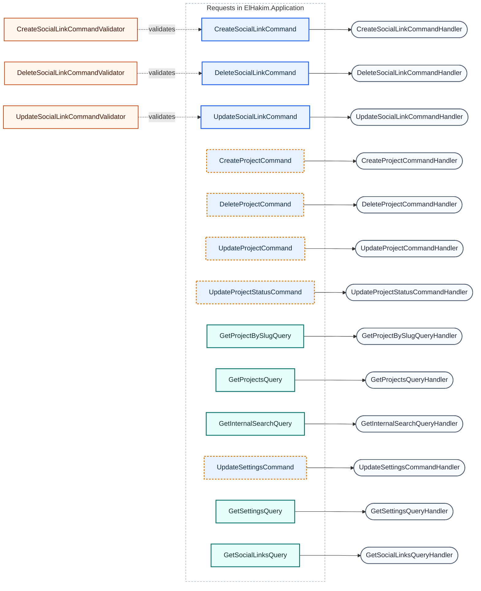
```mermaid
flowchart LR
    accTitle: CQRS map
    accDescr: 13 requests, 13 handlers, 3 validators, 5 CommandWithoutValidator.
    subgraph prj_ElHakim_Application["Requests in ElHakim.Application"]
        req_CreateProjectCommand["CreateProjectCommand"]:::clsCommandNoValidator
        req_DeleteProjectCommand["DeleteProjectCommand"]:::clsCommandNoValidator
        req_UpdateProjectCommand["UpdateProjectCommand"]:::clsCommandNoValidator
        req_UpdateProjectStatusCommand["UpdateProjectStatusCommand"]:::clsCommandNoValidator
        req_GetProjectBySlugQuery["GetProjectBySlugQuery"]:::clsQuery
        req_GetProjectsQuery["GetProjectsQuery"]:::clsQuery
        req_GetInternalSearchQuery["GetInternalSearchQuery"]:::clsQuery
        req_UpdateSettingsCommand["UpdateSettingsCommand"]:::clsCommandNoValidator
        req_GetSettingsQuery["GetSettingsQuery"]:::clsQuery
        req_CreateSocialLinkCommand["CreateSocialLinkCommand"]:::clsCommand
        req_DeleteSocialLinkCommand["DeleteSocialLinkCommand"]:::clsCommand
        req_UpdateSocialLinkCommand["UpdateSocialLinkCommand"]:::clsCommand
        req_GetSocialLinksQuery["GetSocialLinksQuery"]:::clsQuery
    end
    hdl_CreateProjectCommandHandler(["CreateProjectCommandHandler"]):::clsHandler
    hdl_DeleteProjectCommandHandler(["DeleteProjectCommandHandler"]):::clsHandler
    hdl_UpdateProjectCommandHandler(["UpdateProjectCommandHandler"]):::clsHandler
    hdl_UpdateProjectStatusCommandHandler(["UpdateProjectStatusCommandHandler"]):::clsHandler
    hdl_GetProjectBySlugQueryHandler(["GetProjectBySlugQueryHandler"]):::clsHandler
    hdl_GetProjectsQueryHandler(["GetProjectsQueryHandler"]):::clsHandler
    hdl_GetInternalSearchQueryHandler(["GetInternalSearchQueryHandler"]):::clsHandler
    hdl_UpdateSettingsCommandHandler(["UpdateSettingsCommandHandler"]):::clsHandler
    hdl_GetSettingsQueryHandler(["GetSettingsQueryHandler"]):::clsHandler
    hdl_CreateSocialLinkCommandHandler(["CreateSocialLinkCommandHandler"]):::clsHandler
    hdl_DeleteSocialLinkCommandHandler(["DeleteSocialLinkCommandHandler"]):::clsHandler
    hdl_UpdateSocialLinkCommandHandler(["UpdateSocialLinkCommandHandler"]):::clsHandler
    hdl_GetSocialLinksQueryHandler(["GetSocialLinksQueryHandler"]):::clsHandler
    val_CreateSocialLinkCommandValidator["CreateSocialLinkCommandValidator"]:::clsValidator
    val_DeleteSocialLinkCommandValidator["DeleteSocialLinkCommandValidator"]:::clsValidator
    val_UpdateSocialLinkCommandValidator["UpdateSocialLinkCommandValidator"]:::clsValidator
    req_CreateProjectCommand --> hdl_CreateProjectCommandHandler
    req_DeleteProjectCommand --> hdl_DeleteProjectCommandHandler
    req_UpdateProjectCommand --> hdl_UpdateProjectCommandHandler
    req_UpdateProjectStatusCommand --> hdl_UpdateProjectStatusCommandHandler
    req_GetProjectBySlugQuery --> hdl_GetProjectBySlugQueryHandler
    req_GetProjectsQuery --> hdl_GetProjectsQueryHandler
    req_GetInternalSearchQuery --> hdl_GetInternalSearchQueryHandler
    req_UpdateSettingsCommand --> hdl_UpdateSettingsCommandHandler
    req_GetSettingsQuery --> hdl_GetSettingsQueryHandler
    req_CreateSocialLinkCommand --> hdl_CreateSocialLinkCommandHandler
    val_CreateSocialLinkCommandValidator -.->|validates| req_CreateSocialLinkCommand
    req_DeleteSocialLinkCommand --> hdl_DeleteSocialLinkCommandHandler
    val_DeleteSocialLinkCommandValidator -.->|validates| req_DeleteSocialLinkCommand
    req_UpdateSocialLinkCommand --> hdl_UpdateSocialLinkCommandHandler
    val_UpdateSocialLinkCommandValidator -.->|validates| req_UpdateSocialLinkCommand
    req_GetSocialLinksQuery --> hdl_GetSocialLinksQueryHandler
    style prj_ElHakim_Application fill:none,stroke:#94a3b8,stroke-dasharray:4 3
    classDef clsCommand fill:#e8f1ff,stroke:#2563eb,stroke-width:2px,color:#102a43
    classDef clsQuery fill:#e6fffa,stroke:#0f766e,stroke-width:2px,color:#0f2e2e
    classDef clsRequest fill:#f5f3ff,stroke:#6d28d9,stroke-width:2px,color:#2e1065
    classDef clsHandler fill:#f8fafc,stroke:#475569,stroke-width:1.5px,color:#1e293b
    classDef clsValidator fill:#fff7ed,stroke:#c2410c,stroke-width:1.5px,color:#431407
    classDef clsCommandNoValidator fill:#e8f1ff,stroke:#d97706,stroke-width:2px,stroke-dasharray:4 3,color:#102a43
```

_13 requests · 13 handlers · 3 validators · 5 CommandWithoutValidator findings_

### ElHakim.Application — 10 of 63 requests (part 6 of 6)

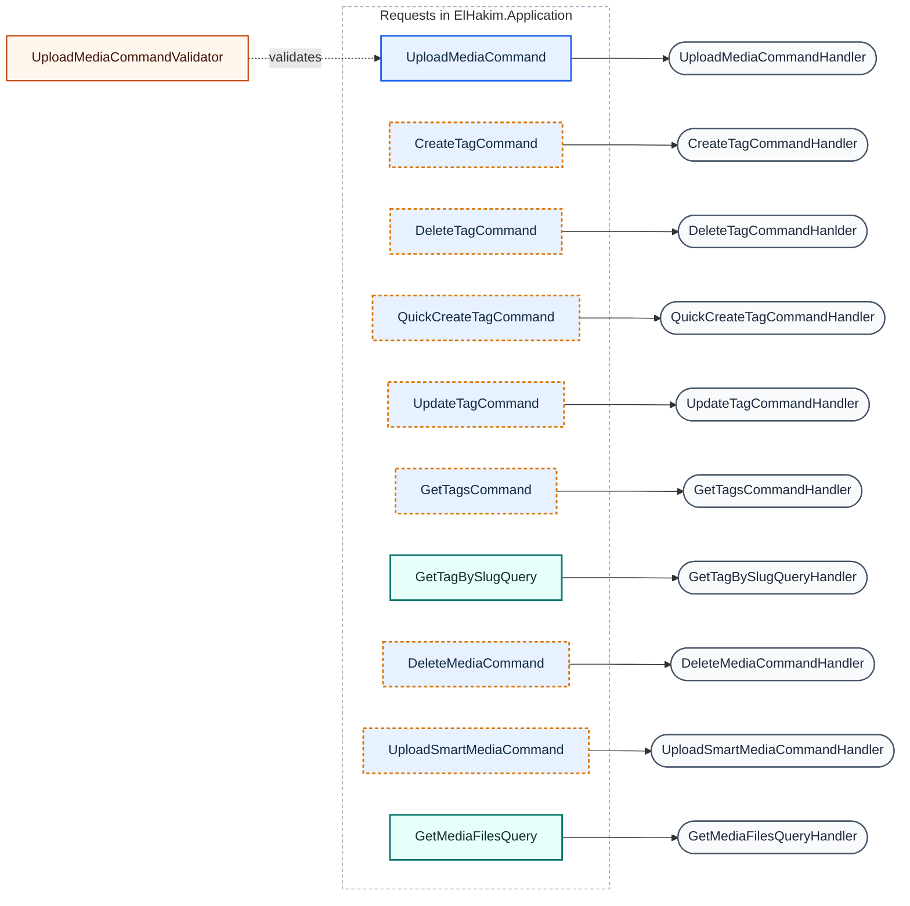
```mermaid
flowchart LR
    accTitle: CQRS map
    accDescr: 10 requests, 10 handlers, 1 validator, 7 CommandWithoutValidator.
    subgraph prj_ElHakim_Application["Requests in ElHakim.Application"]
        req_CreateTagCommand["CreateTagCommand"]:::clsCommandNoValidator
        req_DeleteTagCommand["DeleteTagCommand"]:::clsCommandNoValidator
        req_QuickCreateTagCommand["QuickCreateTagCommand"]:::clsCommandNoValidator
        req_UpdateTagCommand["UpdateTagCommand"]:::clsCommandNoValidator
        req_GetTagsCommand["GetTagsCommand"]:::clsCommandNoValidator
        req_GetTagBySlugQuery["GetTagBySlugQuery"]:::clsQuery
        req_DeleteMediaCommand["DeleteMediaCommand"]:::clsCommandNoValidator
        req_UploadMediaCommand["UploadMediaCommand"]:::clsCommand
        req_UploadSmartMediaCommand["UploadSmartMediaCommand"]:::clsCommandNoValidator
        req_GetMediaFilesQuery["GetMediaFilesQuery"]:::clsQuery
    end
    hdl_CreateTagCommandHandler(["CreateTagCommandHandler"]):::clsHandler
    hdl_DeleteTagCommandHanlder(["DeleteTagCommandHanlder"]):::clsHandler
    hdl_QuickCreateTagCommandHandler(["QuickCreateTagCommandHandler"]):::clsHandler
    hdl_UpdateTagCommandHandler(["UpdateTagCommandHandler"]):::clsHandler
    hdl_GetTagBySlugQueryHandler(["GetTagBySlugQueryHandler"]):::clsHandler
    hdl_GetTagsCommandHandler(["GetTagsCommandHandler"]):::clsHandler
    hdl_DeleteMediaCommandHandler(["DeleteMediaCommandHandler"]):::clsHandler
    hdl_GetMediaFilesQueryHandler(["GetMediaFilesQueryHandler"]):::clsHandler
    hdl_UploadMediaCommandHandler(["UploadMediaCommandHandler"]):::clsHandler
    hdl_UploadSmartMediaCommandHandler(["UploadSmartMediaCommandHandler"]):::clsHandler
    val_UploadMediaCommandValidator["UploadMediaCommandValidator"]:::clsValidator
    req_CreateTagCommand --> hdl_CreateTagCommandHandler
    req_DeleteTagCommand --> hdl_DeleteTagCommandHanlder
    req_QuickCreateTagCommand --> hdl_QuickCreateTagCommandHandler
    req_UpdateTagCommand --> hdl_UpdateTagCommandHandler
    req_GetTagsCommand --> hdl_GetTagsCommandHandler
    req_GetTagBySlugQuery --> hdl_GetTagBySlugQueryHandler
    req_DeleteMediaCommand --> hdl_DeleteMediaCommandHandler
    req_UploadMediaCommand --> hdl_UploadMediaCommandHandler
    val_UploadMediaCommandValidator -.->|validates| req_UploadMediaCommand
    req_UploadSmartMediaCommand --> hdl_UploadSmartMediaCommandHandler
    req_GetMediaFilesQuery --> hdl_GetMediaFilesQueryHandler
    style prj_ElHakim_Application fill:none,stroke:#94a3b8,stroke-dasharray:4 3
    classDef clsCommand fill:#e8f1ff,stroke:#2563eb,stroke-width:2px,color:#102a43
    classDef clsQuery fill:#e6fffa,stroke:#0f766e,stroke-width:2px,color:#0f2e2e
    classDef clsRequest fill:#f5f3ff,stroke:#6d28d9,stroke-width:2px,color:#2e1065
    classDef clsHandler fill:#f8fafc,stroke:#475569,stroke-width:1.5px,color:#1e293b
    classDef clsValidator fill:#fff7ed,stroke:#c2410c,stroke-width:1.5px,color:#431407
    classDef clsCommandNoValidator fill:#e8f1ff,stroke:#d97706,stroke-width:2px,stroke-dasharray:4 3,color:#102a43
```

_10 requests · 10 handlers · 1 validator · 7 CommandWithoutValidator findings_

## Validation Coverage

_The share of requests with a linked validator (the model's request→validator linkage). A request with no linked validator is also reported individually by the command-without-validator check._

| Project | Requests | With linked validator | Coverage | Validators |
| --- | ---: | ---: | ---: | ---: |
| ElHakim.Application | 63 | 8 | 12.7% | 9 |
| **All projects** | **63** | **8** | **12.7%** | **9** |

## Flow

_123 resolved flow edges across 15 feature/project diagrams (endpoint → request → handler and onward; DbContext nodes appear only when a handler directly references a discovered DbContext type; every flow edge appears in exactly one diagram). 17 unresolved dispatch call(s) are not drawn as edges._

**Legend:** blue stadium = endpoint · blue = request · gray = handler · fuchsia = notification · green = DbContext.

### ElHakim.Application — Auth — flow

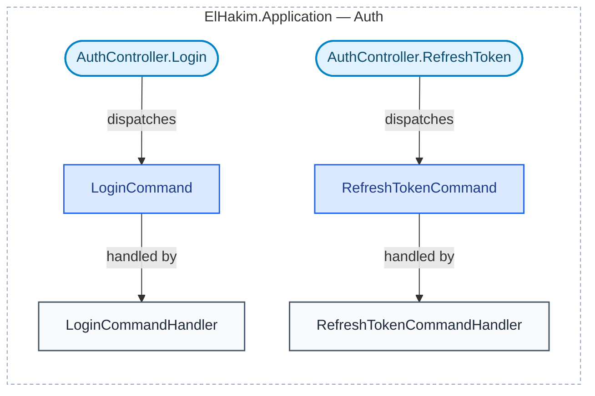
```mermaid
flowchart LR
    accTitle: Flow map
    accDescr: 4 edges, 6 nodes.
    subgraph flow["ElHakim.Application — Auth"]
        ep_AuthController_Login(["AuthController.Login"]):::clsFlowEndpoint
        req_LoginCommand["LoginCommand"]:::clsFlowRequest
        ep_AuthController_RefreshToken(["AuthController.RefreshToken"]):::clsFlowEndpoint
        req_RefreshTokenCommand["RefreshTokenCommand"]:::clsFlowRequest
        hdl_LoginCommandHandler["LoginCommandHandler"]:::clsFlowHandler
        hdl_RefreshTokenCommandHandler["RefreshTokenCommandHandler"]:::clsFlowHandler
    end
    ep_AuthController_Login -->|dispatches| req_LoginCommand
    ep_AuthController_RefreshToken -->|dispatches| req_RefreshTokenCommand
    req_LoginCommand -->|handled by| hdl_LoginCommandHandler
    req_RefreshTokenCommand -->|handled by| hdl_RefreshTokenCommandHandler
    classDef clsFlowEndpoint fill:#e0f2fe,stroke:#0284c7,stroke-width:2px,color:#0c4a6e
    classDef clsFlowRequest fill:#dbeafe,stroke:#2563eb,stroke-width:1.5px,color:#1e3a8a
    classDef clsFlowHandler fill:#f8fafc,stroke:#475569,stroke-width:1.5px,color:#1e293b
    classDef clsFlowNotification fill:#fdf4ff,stroke:#a21caf,stroke-width:2px,color:#4a044e
    classDef clsFlowDbContext fill:#ecfdf5,stroke:#059669,stroke-width:2px,color:#064e3b
    style flow fill:none,stroke:#94a3b8,stroke-dasharray:4 3
```

_4 edges · 2 connected flows_

### ElHakim.Application — Comments — flow

```mermaid
flowchart LR
    accTitle: Flow map
    accDescr: 16 edges, 24 nodes.
    subgraph flow["ElHakim.Application — Comments"]
        ep_AdminCommentsController_List(["AdminCommentsController.List"]):::clsFlowEndpoint
        req_GetAdminCommentsQuery["GetAdminCommentsQuery"]:::clsFlowRequest
        ep_AdminCommentsController_UpdateStatus(["AdminCommentsController.UpdateStatus"]):::clsFlowEndpoint
        req_UpdateCommentStatusCommand["UpdateCommentStatusCommand"]:::clsFlowRequest
        ep_AdminUsersController_List(["AdminUsersController.List"]):::clsFlowEndpoint
        req_GetAdminUsersQuery["GetAdminUsersQuery"]:::clsFlowRequest
        ep_AdminUsersController_ToggleBlock(["AdminUsersController.ToggleBlock"]):::clsFlowEndpoint
        req_ToggleUserBlockCommand["ToggleUserBlockCommand"]:::clsFlowRequest
        ep_CommentsController_CreateComment(["CommentsController.CreateComment"]):::clsFlowEndpoint
        req_CreateCommentCommand["CreateCommentCommand"]:::clsFlowRequest
        ep_CommentsController_GetComments(["CommentsController.GetComments"]):::clsFlowEndpoint
        req_GetPostCommentsQuery["GetPostCommentsQuery"]:::clsFlowRequest
        ep_CommentsController_GetStats(["CommentsController.GetStats"]):::clsFlowEndpoint
        req_GetCommentStatsQuery["GetCommentStatsQuery"]:::clsFlowRequest
        ep_CommentsController_Vote(["CommentsController.Vote"]):::clsFlowEndpoint
        req_ToggleCommentVoteCommand["ToggleCommentVoteCommand"]:::clsFlowRequest
        hdl_CreateCommentCommandHandler["CreateCommentCommandHandler"]:::clsFlowHandler
        hdl_ToggleCommentVoteCommandHandler["ToggleCommentVoteCommandHandler"]:::clsFlowHandler
        hdl_ToggleUserBlockCommandHandler["ToggleUserBlockCommandHandler"]:::clsFlowHandler
        hdl_UpdateCommentStatusCommandHandler["UpdateCommentStatusCommandHandler"]:::clsFlowHandler
        hdl_GetAdminCommentsQueryHandler["GetAdminCommentsQueryHandler"]:::clsFlowHandler
        hdl_GetAdminUsersQueryHandler["GetAdminUsersQueryHandler"]:::clsFlowHandler
        hdl_GetCommentStatsQueryHandler["GetCommentStatsQueryHandler"]:::clsFlowHandler
        hdl_GetPostCommentsQueryHandler["GetPostCommentsQueryHandler"]:::clsFlowHandler
    end
    ep_AdminCommentsController_List -->|dispatches| req_GetAdminCommentsQuery
    ep_AdminCommentsController_UpdateStatus -->|dispatches| req_UpdateCommentStatusCommand
    ep_AdminUsersController_List -->|dispatches| req_GetAdminUsersQuery
    ep_AdminUsersController_ToggleBlock -->|dispatches| req_ToggleUserBlockCommand
    ep_CommentsController_CreateComment -->|dispatches| req_CreateCommentCommand
    ep_CommentsController_GetComments -->|dispatches| req_GetPostCommentsQuery
    ep_CommentsController_GetStats -->|dispatches| req_GetCommentStatsQuery
    ep_CommentsController_Vote -->|dispatches| req_ToggleCommentVoteCommand
    req_CreateCommentCommand -->|handled by| hdl_CreateCommentCommandHandler
    req_ToggleCommentVoteCommand -->|handled by| hdl_ToggleCommentVoteCommandHandler
    req_ToggleUserBlockCommand -->|handled by| hdl_ToggleUserBlockCommandHandler
    req_UpdateCommentStatusCommand -->|handled by| hdl_UpdateCommentStatusCommandHandler
    req_GetAdminCommentsQuery -->|handled by| hdl_GetAdminCommentsQueryHandler
    req_GetAdminUsersQuery -->|handled by| hdl_GetAdminUsersQueryHandler
    req_GetCommentStatsQuery -->|handled by| hdl_GetCommentStatsQueryHandler
    req_GetPostCommentsQuery -->|handled by| hdl_GetPostCommentsQueryHandler
    classDef clsFlowEndpoint fill:#e0f2fe,stroke:#0284c7,stroke-width:2px,color:#0c4a6e
    classDef clsFlowRequest fill:#dbeafe,stroke:#2563eb,stroke-width:1.5px,color:#1e3a8a
    classDef clsFlowHandler fill:#f8fafc,stroke:#475569,stroke-width:1.5px,color:#1e293b
    classDef clsFlowNotification fill:#fdf4ff,stroke:#a21caf,stroke-width:2px,color:#4a044e
    classDef clsFlowDbContext fill:#ecfdf5,stroke:#059669,stroke-width:2px,color:#064e3b
    style flow fill:none,stroke:#94a3b8,stroke-dasharray:4 3
```

_16 edges · 8 connected flows_

### ElHakim.Application — ContentPages — flow

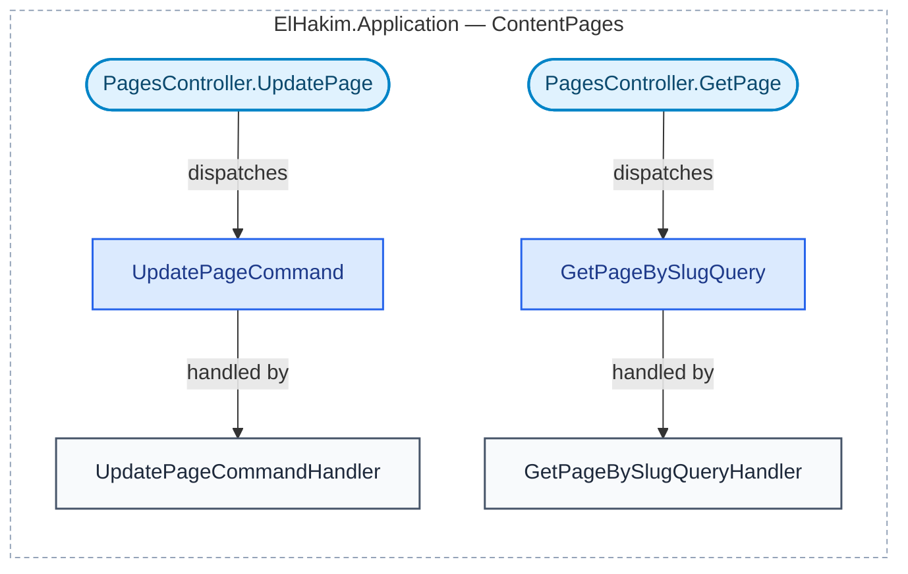
```mermaid
flowchart LR
    accTitle: Flow map
    accDescr: 4 edges, 6 nodes.
    subgraph flow["ElHakim.Application — ContentPages"]
        ep_PagesController_GetPage(["PagesController.GetPage"]):::clsFlowEndpoint
        req_GetPageBySlugQuery["GetPageBySlugQuery"]:::clsFlowRequest
        ep_PagesController_UpdatePage(["PagesController.UpdatePage"]):::clsFlowEndpoint
        req_UpdatePageCommand["UpdatePageCommand"]:::clsFlowRequest
        hdl_UpdatePageCommandHandler["UpdatePageCommandHandler"]:::clsFlowHandler
        hdl_GetPageBySlugQueryHandler["GetPageBySlugQueryHandler"]:::clsFlowHandler
    end
    ep_PagesController_GetPage -->|dispatches| req_GetPageBySlugQuery
    ep_PagesController_UpdatePage -->|dispatches| req_UpdatePageCommand
    req_UpdatePageCommand -->|handled by| hdl_UpdatePageCommandHandler
    req_GetPageBySlugQuery -->|handled by| hdl_GetPageBySlugQueryHandler
    classDef clsFlowEndpoint fill:#e0f2fe,stroke:#0284c7,stroke-width:2px,color:#0c4a6e
    classDef clsFlowRequest fill:#dbeafe,stroke:#2563eb,stroke-width:1.5px,color:#1e3a8a
    classDef clsFlowHandler fill:#f8fafc,stroke:#475569,stroke-width:1.5px,color:#1e293b
    classDef clsFlowNotification fill:#fdf4ff,stroke:#a21caf,stroke-width:2px,color:#4a044e
    classDef clsFlowDbContext fill:#ecfdf5,stroke:#059669,stroke-width:2px,color:#064e3b
    style flow fill:none,stroke:#94a3b8,stroke-dasharray:4 3
```

_4 edges · 2 connected flows_

### ElHakim.Application — External — flow

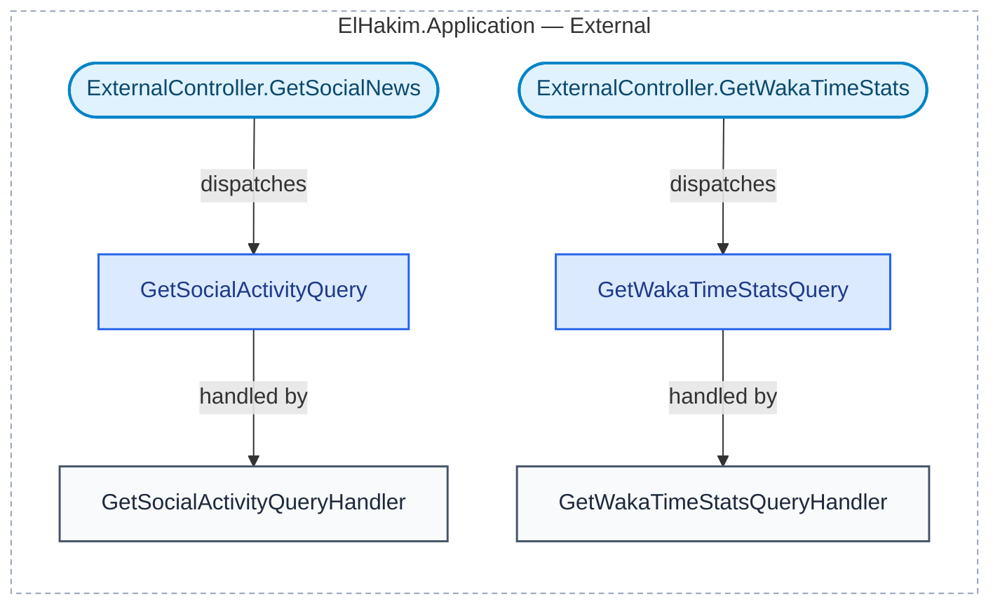
```mermaid
flowchart LR
    accTitle: Flow map
    accDescr: 4 edges, 6 nodes.
    subgraph flow["ElHakim.Application — External"]
        ep_ExternalController_GetSocialNews(["ExternalController.GetSocialNews"]):::clsFlowEndpoint
        req_GetSocialActivityQuery["GetSocialActivityQuery"]:::clsFlowRequest
        ep_ExternalController_GetWakaTimeStats(["ExternalController.GetWakaTimeStats"]):::clsFlowEndpoint
        req_GetWakaTimeStatsQuery["GetWakaTimeStatsQuery"]:::clsFlowRequest
        hdl_GetSocialActivityQueryHandler["GetSocialActivityQueryHandler"]:::clsFlowHandler
        hdl_GetWakaTimeStatsQueryHandler["GetWakaTimeStatsQueryHandler"]:::clsFlowHandler
    end
    ep_ExternalController_GetSocialNews -->|dispatches| req_GetSocialActivityQuery
    ep_ExternalController_GetWakaTimeStats -->|dispatches| req_GetWakaTimeStatsQuery
    req_GetSocialActivityQuery -->|handled by| hdl_GetSocialActivityQueryHandler
    req_GetWakaTimeStatsQuery -->|handled by| hdl_GetWakaTimeStatsQueryHandler
    classDef clsFlowEndpoint fill:#e0f2fe,stroke:#0284c7,stroke-width:2px,color:#0c4a6e
    classDef clsFlowRequest fill:#dbeafe,stroke:#2563eb,stroke-width:1.5px,color:#1e3a8a
    classDef clsFlowHandler fill:#f8fafc,stroke:#475569,stroke-width:1.5px,color:#1e293b
    classDef clsFlowNotification fill:#fdf4ff,stroke:#a21caf,stroke-width:2px,color:#4a044e
    classDef clsFlowDbContext fill:#ecfdf5,stroke:#059669,stroke-width:2px,color:#064e3b
    style flow fill:none,stroke:#94a3b8,stroke-dasharray:4 3
```

_4 edges · 2 connected flows_

### ElHakim.Application — Guestbook — flow

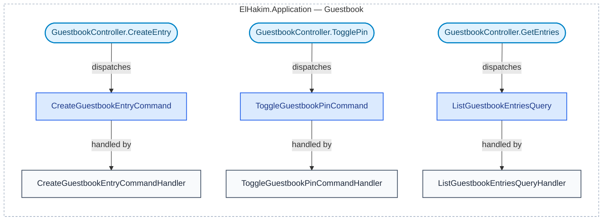
```mermaid
flowchart LR
    accTitle: Flow map
    accDescr: 6 edges, 9 nodes.
    subgraph flow["ElHakim.Application — Guestbook"]
        ep_GuestbookController_CreateEntry(["GuestbookController.CreateEntry"]):::clsFlowEndpoint
        req_CreateGuestbookEntryCommand["CreateGuestbookEntryCommand"]:::clsFlowRequest
        ep_GuestbookController_GetEntries(["GuestbookController.GetEntries"]):::clsFlowEndpoint
        req_ListGuestbookEntriesQuery["ListGuestbookEntriesQuery"]:::clsFlowRequest
        ep_GuestbookController_TogglePin(["GuestbookController.TogglePin"]):::clsFlowEndpoint
        req_ToggleGuestbookPinCommand["ToggleGuestbookPinCommand"]:::clsFlowRequest
        hdl_CreateGuestbookEntryCommandHandler["CreateGuestbookEntryCommandHandler"]:::clsFlowHandler
        hdl_ToggleGuestbookPinCommandHandler["ToggleGuestbookPinCommandHandler"]:::clsFlowHandler
        hdl_ListGuestbookEntriesQueryHandler["ListGuestbookEntriesQueryHandler"]:::clsFlowHandler
    end
    ep_GuestbookController_CreateEntry -->|dispatches| req_CreateGuestbookEntryCommand
    ep_GuestbookController_GetEntries -->|dispatches| req_ListGuestbookEntriesQuery
    ep_GuestbookController_TogglePin -->|dispatches| req_ToggleGuestbookPinCommand
    req_CreateGuestbookEntryCommand -->|handled by| hdl_CreateGuestbookEntryCommandHandler
    req_ToggleGuestbookPinCommand -->|handled by| hdl_ToggleGuestbookPinCommandHandler
    req_ListGuestbookEntriesQuery -->|handled by| hdl_ListGuestbookEntriesQueryHandler
    classDef clsFlowEndpoint fill:#e0f2fe,stroke:#0284c7,stroke-width:2px,color:#0c4a6e
    classDef clsFlowRequest fill:#dbeafe,stroke:#2563eb,stroke-width:1.5px,color:#1e3a8a
    classDef clsFlowHandler fill:#f8fafc,stroke:#475569,stroke-width:1.5px,color:#1e293b
    classDef clsFlowNotification fill:#fdf4ff,stroke:#a21caf,stroke-width:2px,color:#4a044e
    classDef clsFlowDbContext fill:#ecfdf5,stroke:#059669,stroke-width:2px,color:#064e3b
    style flow fill:none,stroke:#94a3b8,stroke-dasharray:4 3
```

_6 edges · 3 connected flows_

### ElHakim.Application — JobApplications — flow

```mermaid
flowchart LR
    accTitle: Flow map
    accDescr: 10 edges, 15 nodes.
    subgraph flow["ElHakim.Application — JobApplications"]
        ep_JobApplicationsController_AutoApply(["JobApplicationsController.AutoApply"]):::clsFlowEndpoint
        req_AutoApplyJobCommand["AutoApplyJobCommand"]:::clsFlowRequest
        ep_JobApplicationsController_CreateManual(["JobApplicationsController.CreateManual"]):::clsFlowEndpoint
        req_CreateManualJobCommand["CreateManualJobCommand"]:::clsFlowRequest
        ep_JobApplicationsController_GetAll(["JobApplicationsController.GetAll"]):::clsFlowEndpoint
        req_GetJobApplicationsQuery["GetJobApplicationsQuery"]:::clsFlowRequest
        ep_JobApplicationsController_MarkApplied(["JobApplicationsController.MarkApplied"]):::clsFlowEndpoint
        req_MarkAppliedCommand["MarkAppliedCommand"]:::clsFlowRequest
        ep_JobApplicationsController_SendMail(["JobApplicationsController.SendMail"]):::clsFlowEndpoint
        req_SendDirectMailCommand["SendDirectMailCommand"]:::clsFlowRequest
        hdl_AutoApplyJobCommandHandler["AutoApplyJobCommandHandler"]:::clsFlowHandler
        hdl_CreateManualJobCommandHandler["CreateManualJobCommandHandler"]:::clsFlowHandler
        hdl_MarkAppliedCommandHandler["MarkAppliedCommandHandler"]:::clsFlowHandler
        hdl_SendDirectMailCommandHandler["SendDirectMailCommandHandler"]:::clsFlowHandler
        hdl_GetJobApplicationsQueryHandler["GetJobApplicationsQueryHandler"]:::clsFlowHandler
    end
    ep_JobApplicationsController_AutoApply -->|dispatches| req_AutoApplyJobCommand
    ep_JobApplicationsController_CreateManual -->|dispatches| req_CreateManualJobCommand
    ep_JobApplicationsController_GetAll -->|dispatches| req_GetJobApplicationsQuery
    ep_JobApplicationsController_MarkApplied -->|dispatches| req_MarkAppliedCommand
    ep_JobApplicationsController_SendMail -->|dispatches| req_SendDirectMailCommand
    req_AutoApplyJobCommand -->|handled by| hdl_AutoApplyJobCommandHandler
    req_CreateManualJobCommand -->|handled by| hdl_CreateManualJobCommandHandler
    req_MarkAppliedCommand -->|handled by| hdl_MarkAppliedCommandHandler
    req_SendDirectMailCommand -->|handled by| hdl_SendDirectMailCommandHandler
    req_GetJobApplicationsQuery -->|handled by| hdl_GetJobApplicationsQueryHandler
    classDef clsFlowEndpoint fill:#e0f2fe,stroke:#0284c7,stroke-width:2px,color:#0c4a6e
    classDef clsFlowRequest fill:#dbeafe,stroke:#2563eb,stroke-width:1.5px,color:#1e3a8a
    classDef clsFlowHandler fill:#f8fafc,stroke:#475569,stroke-width:1.5px,color:#1e293b
    classDef clsFlowNotification fill:#fdf4ff,stroke:#a21caf,stroke-width:2px,color:#4a044e
    classDef clsFlowDbContext fill:#ecfdf5,stroke:#059669,stroke-width:2px,color:#064e3b
    style flow fill:none,stroke:#94a3b8,stroke-dasharray:4 3
```

_10 edges · 5 connected flows_

### ElHakim.Application — Likes — flow

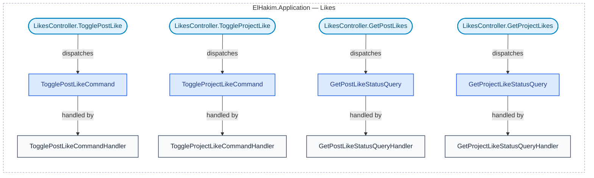
```mermaid
flowchart LR
    accTitle: Flow map
    accDescr: 8 edges, 12 nodes.
    subgraph flow["ElHakim.Application — Likes"]
        ep_LikesController_GetPostLikes(["LikesController.GetPostLikes"]):::clsFlowEndpoint
        req_GetPostLikeStatusQuery["GetPostLikeStatusQuery"]:::clsFlowRequest
        ep_LikesController_GetProjectLikes(["LikesController.GetProjectLikes"]):::clsFlowEndpoint
        req_GetProjectLikeStatusQuery["GetProjectLikeStatusQuery"]:::clsFlowRequest
        ep_LikesController_TogglePostLike(["LikesController.TogglePostLike"]):::clsFlowEndpoint
        req_TogglePostLikeCommand["TogglePostLikeCommand"]:::clsFlowRequest
        ep_LikesController_ToggleProjectLike(["LikesController.ToggleProjectLike"]):::clsFlowEndpoint
        req_ToggleProjectLikeCommand["ToggleProjectLikeCommand"]:::clsFlowRequest
        hdl_TogglePostLikeCommandHandler["TogglePostLikeCommandHandler"]:::clsFlowHandler
        hdl_ToggleProjectLikeCommandHandler["ToggleProjectLikeCommandHandler"]:::clsFlowHandler
        hdl_GetPostLikeStatusQueryHandler["GetPostLikeStatusQueryHandler"]:::clsFlowHandler
        hdl_GetProjectLikeStatusQueryHandler["GetProjectLikeStatusQueryHandler"]:::clsFlowHandler
    end
    ep_LikesController_GetPostLikes -->|dispatches| req_GetPostLikeStatusQuery
    ep_LikesController_GetProjectLikes -->|dispatches| req_GetProjectLikeStatusQuery
    ep_LikesController_TogglePostLike -->|dispatches| req_TogglePostLikeCommand
    ep_LikesController_ToggleProjectLike -->|dispatches| req_ToggleProjectLikeCommand
    req_TogglePostLikeCommand -->|handled by| hdl_TogglePostLikeCommandHandler
    req_ToggleProjectLikeCommand -->|handled by| hdl_ToggleProjectLikeCommandHandler
    req_GetPostLikeStatusQuery -->|handled by| hdl_GetPostLikeStatusQueryHandler
    req_GetProjectLikeStatusQuery -->|handled by| hdl_GetProjectLikeStatusQueryHandler
    classDef clsFlowEndpoint fill:#e0f2fe,stroke:#0284c7,stroke-width:2px,color:#0c4a6e
    classDef clsFlowRequest fill:#dbeafe,stroke:#2563eb,stroke-width:1.5px,color:#1e3a8a
    classDef clsFlowHandler fill:#f8fafc,stroke:#475569,stroke-width:1.5px,color:#1e293b
    classDef clsFlowNotification fill:#fdf4ff,stroke:#a21caf,stroke-width:2px,color:#4a044e
    classDef clsFlowDbContext fill:#ecfdf5,stroke:#059669,stroke-width:2px,color:#064e3b
    style flow fill:none,stroke:#94a3b8,stroke-dasharray:4 3
```

_8 edges · 4 connected flows_

### ElHakim.Application — PageView — flow

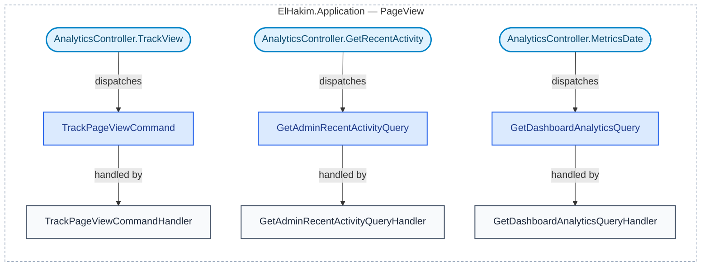
```mermaid
flowchart LR
    accTitle: Flow map
    accDescr: 6 edges, 9 nodes.
    subgraph flow["ElHakim.Application — PageView"]
        ep_AnalyticsController_GetRecentActivity(["AnalyticsController.GetRecentActivity"]):::clsFlowEndpoint
        req_GetAdminRecentActivityQuery["GetAdminRecentActivityQuery"]:::clsFlowRequest
        ep_AnalyticsController_MetricsDate(["AnalyticsController.MetricsDate"]):::clsFlowEndpoint
        req_GetDashboardAnalyticsQuery["GetDashboardAnalyticsQuery"]:::clsFlowRequest
        ep_AnalyticsController_TrackView(["AnalyticsController.TrackView"]):::clsFlowEndpoint
        req_TrackPageViewCommand["TrackPageViewCommand"]:::clsFlowRequest
        hdl_TrackPageViewCommandHandler["TrackPageViewCommandHandler"]:::clsFlowHandler
        hdl_GetAdminRecentActivityQueryHandler["GetAdminRecentActivityQueryHandler"]:::clsFlowHandler
        hdl_GetDashboardAnalyticsQueryHandler["GetDashboardAnalyticsQueryHandler"]:::clsFlowHandler
    end
    ep_AnalyticsController_GetRecentActivity -->|dispatches| req_GetAdminRecentActivityQuery
    ep_AnalyticsController_MetricsDate -->|dispatches| req_GetDashboardAnalyticsQuery
    ep_AnalyticsController_TrackView -->|dispatches| req_TrackPageViewCommand
    req_TrackPageViewCommand -->|handled by| hdl_TrackPageViewCommandHandler
    req_GetAdminRecentActivityQuery -->|handled by| hdl_GetAdminRecentActivityQueryHandler
    req_GetDashboardAnalyticsQuery -->|handled by| hdl_GetDashboardAnalyticsQueryHandler
    classDef clsFlowEndpoint fill:#e0f2fe,stroke:#0284c7,stroke-width:2px,color:#0c4a6e
    classDef clsFlowRequest fill:#dbeafe,stroke:#2563eb,stroke-width:1.5px,color:#1e3a8a
    classDef clsFlowHandler fill:#f8fafc,stroke:#475569,stroke-width:1.5px,color:#1e293b
    classDef clsFlowNotification fill:#fdf4ff,stroke:#a21caf,stroke-width:2px,color:#4a044e
    classDef clsFlowDbContext fill:#ecfdf5,stroke:#059669,stroke-width:2px,color:#064e3b
    style flow fill:none,stroke:#94a3b8,stroke-dasharray:4 3
```

_6 edges · 3 connected flows_

### ElHakim.Application — Posts — flow

```mermaid
flowchart LR
    accTitle: Flow map
    accDescr: 20 edges, 31 nodes.
    subgraph flow["ElHakim.Application — Posts"]
        ep_PostsController_CreateRevision(["PostsController.CreateRevision"]):::clsFlowEndpoint
        req_CreatePostRevisionCommand["CreatePostRevisionCommand"]:::clsFlowRequest
        ep_PostsController_DeletePost(["PostsController.DeletePost"]):::clsFlowEndpoint
        req_DeletePostCommand["DeletePostCommand"]:::clsFlowRequest
        ep_PostsController_GetPostSlugs(["PostsController.GetPostSlugs"]):::clsFlowEndpoint
        req_GetPostSlugsQuery["GetPostSlugsQuery"]:::clsFlowRequest
        ep_PostsController_GetRevisions(["PostsController.GetRevisions"]):::clsFlowEndpoint
        req_GetPostRevisionsQuery["GetPostRevisionsQuery"]:::clsFlowRequest
        ep_PostsController_LikePost(["PostsController.LikePost"]):::clsFlowEndpoint
        req_TogglePostLikeCommand["TogglePostLikeCommand"]:::clsFlowRequest
        ep_PostsController_PostDetail(["PostsController.PostDetail"]):::clsFlowEndpoint
        req_GetPostBySlugQuery["GetPostBySlugQuery"]:::clsFlowRequest
        ep_PostsController_PublishPost(["PostsController.PublishPost"]):::clsFlowEndpoint
        req_PublishPostCommand["PublishPostCommand"]:::clsFlowRequest
        ep_PostsController_UpdatePost(["PostsController.UpdatePost"]):::clsFlowEndpoint
        req_UpdatePostCommand["UpdatePostCommand"]:::clsFlowRequest
        ep_PostsController_UpdateStatus(["PostsController.UpdateStatus"]):::clsFlowEndpoint
        req_UpdatePostStatusCommand["UpdatePostStatusCommand"]:::clsFlowRequest
        req_CreatePostCommand["CreatePostCommand"]:::clsFlowRequest
        hdl_CreatePostCommandHandler["CreatePostCommandHandler"]:::clsFlowHandler
        hdl_CreatePostRevisionCommandHandler["CreatePostRevisionCommandHandler"]:::clsFlowHandler
        hdl_DeletePostCommandHandler["DeletePostCommandHandler"]:::clsFlowHandler
        hdl_PublishPostCommandHandler["PublishPostCommandHandler"]:::clsFlowHandler
        hdl_TogglePostLikeCommandHandler["TogglePostLikeCommandHandler"]:::clsFlowHandler
        hdl_UpdatePostCommandHandler["UpdatePostCommandHandler"]:::clsFlowHandler
        hdl_UpdatePostStatusCommandHandler["UpdatePostStatusCommandHandler"]:::clsFlowHandler
        hdl_GetPostBySlugQueryHandler["GetPostBySlugQueryHandler"]:::clsFlowHandler
        hdl_GetPostRevisionsQueryHandler["GetPostRevisionsQueryHandler"]:::clsFlowHandler
        hdl_GetPostSlugsQueryHandler["GetPostSlugsQueryHandler"]:::clsFlowHandler
        req_GetPostsQuery["GetPostsQuery"]:::clsFlowRequest
        hdl_GetPostsQueryHandler["GetPostsQueryHandler"]:::clsFlowHandler
    end
    ep_PostsController_CreateRevision -->|dispatches| req_CreatePostRevisionCommand
    ep_PostsController_DeletePost -->|dispatches| req_DeletePostCommand
    ep_PostsController_GetPostSlugs -->|dispatches| req_GetPostSlugsQuery
    ep_PostsController_GetRevisions -->|dispatches| req_GetPostRevisionsQuery
    ep_PostsController_LikePost -->|dispatches| req_TogglePostLikeCommand
    ep_PostsController_PostDetail -->|dispatches| req_GetPostBySlugQuery
    ep_PostsController_PublishPost -->|dispatches| req_PublishPostCommand
    ep_PostsController_UpdatePost -->|dispatches| req_UpdatePostCommand
    ep_PostsController_UpdateStatus -->|dispatches| req_UpdatePostStatusCommand
    req_CreatePostCommand -->|handled by| hdl_CreatePostCommandHandler
    req_CreatePostRevisionCommand -->|handled by| hdl_CreatePostRevisionCommandHandler
    req_DeletePostCommand -->|handled by| hdl_DeletePostCommandHandler
    req_PublishPostCommand -->|handled by| hdl_PublishPostCommandHandler
    req_TogglePostLikeCommand -->|handled by| hdl_TogglePostLikeCommandHandler
    req_UpdatePostCommand -->|handled by| hdl_UpdatePostCommandHandler
    req_UpdatePostStatusCommand -->|handled by| hdl_UpdatePostStatusCommandHandler
    req_GetPostBySlugQuery -->|handled by| hdl_GetPostBySlugQueryHandler
    req_GetPostRevisionsQuery -->|handled by| hdl_GetPostRevisionsQueryHandler
    req_GetPostSlugsQuery -->|handled by| hdl_GetPostSlugsQueryHandler
    req_GetPostsQuery -->|handled by| hdl_GetPostsQueryHandler
    classDef clsFlowEndpoint fill:#e0f2fe,stroke:#0284c7,stroke-width:2px,color:#0c4a6e
    classDef clsFlowRequest fill:#dbeafe,stroke:#2563eb,stroke-width:1.5px,color:#1e3a8a
    classDef clsFlowHandler fill:#f8fafc,stroke:#475569,stroke-width:1.5px,color:#1e293b
    classDef clsFlowNotification fill:#fdf4ff,stroke:#a21caf,stroke-width:2px,color:#4a044e
    classDef clsFlowDbContext fill:#ecfdf5,stroke:#059669,stroke-width:2px,color:#064e3b
    style flow fill:none,stroke:#94a3b8,stroke-dasharray:4 3
```

_20 edges · 11 connected flows_

### ElHakim.Application — Projects — flow

```mermaid
flowchart LR
    accTitle: Flow map
    accDescr: 14 edges, 20 nodes.
    subgraph flow["ElHakim.Application — Projects"]
        ep_ProjectsController_CreateProject(["ProjectsController.CreateProject"]):::clsFlowEndpoint
        req_CreateProjectCommand["CreateProjectCommand"]:::clsFlowRequest
        ep_ProjectsController_DeleteProject(["ProjectsController.DeleteProject"]):::clsFlowEndpoint
        req_DeleteProjectCommand["DeleteProjectCommand"]:::clsFlowRequest
        ep_ProjectsController_GetAdminProject(["ProjectsController.GetAdminProject"]):::clsFlowEndpoint
        req_GetProjectBySlugQuery["GetProjectBySlugQuery"]:::clsFlowRequest
        ep_ProjectsController_GetAdminProjects(["ProjectsController.GetAdminProjects"]):::clsFlowEndpoint
        req_GetProjectsQuery["GetProjectsQuery"]:::clsFlowRequest
        ep_ProjectsController_GetProject(["ProjectsController.GetProject"]):::clsFlowEndpoint
        ep_ProjectsController_GetProjects(["ProjectsController.GetProjects"]):::clsFlowEndpoint
        ep_ProjectsController_UpdateProject(["ProjectsController.UpdateProject"]):::clsFlowEndpoint
        req_UpdateProjectCommand["UpdateProjectCommand"]:::clsFlowRequest
        ep_ProjectsController_UpdateStatus(["ProjectsController.UpdateStatus"]):::clsFlowEndpoint
        req_UpdateProjectStatusCommand["UpdateProjectStatusCommand"]:::clsFlowRequest
        hdl_CreateProjectCommandHandler["CreateProjectCommandHandler"]:::clsFlowHandler
        hdl_DeleteProjectCommandHandler["DeleteProjectCommandHandler"]:::clsFlowHandler
        hdl_UpdateProjectCommandHandler["UpdateProjectCommandHandler"]:::clsFlowHandler
        hdl_UpdateProjectStatusCommandHandler["UpdateProjectStatusCommandHandler"]:::clsFlowHandler
        hdl_GetProjectBySlugQueryHandler["GetProjectBySlugQueryHandler"]:::clsFlowHandler
        hdl_GetProjectsQueryHandler["GetProjectsQueryHandler"]:::clsFlowHandler
    end
    ep_ProjectsController_CreateProject -->|dispatches| req_CreateProjectCommand
    ep_ProjectsController_DeleteProject -->|dispatches| req_DeleteProjectCommand
    ep_ProjectsController_GetAdminProject -->|dispatches| req_GetProjectBySlugQuery
    ep_ProjectsController_GetAdminProjects -->|dispatches| req_GetProjectsQuery
    ep_ProjectsController_GetProject -->|dispatches| req_GetProjectBySlugQuery
    ep_ProjectsController_GetProjects -->|dispatches| req_GetProjectsQuery
    ep_ProjectsController_UpdateProject -->|dispatches| req_UpdateProjectCommand
    ep_ProjectsController_UpdateStatus -->|dispatches| req_UpdateProjectStatusCommand
    req_CreateProjectCommand -->|handled by| hdl_CreateProjectCommandHandler
    req_DeleteProjectCommand -->|handled by| hdl_DeleteProjectCommandHandler
    req_UpdateProjectCommand -->|handled by| hdl_UpdateProjectCommandHandler
    req_UpdateProjectStatusCommand -->|handled by| hdl_UpdateProjectStatusCommandHandler
    req_GetProjectBySlugQuery -->|handled by| hdl_GetProjectBySlugQueryHandler
    req_GetProjectsQuery -->|handled by| hdl_GetProjectsQueryHandler
    classDef clsFlowEndpoint fill:#e0f2fe,stroke:#0284c7,stroke-width:2px,color:#0c4a6e
    classDef clsFlowRequest fill:#dbeafe,stroke:#2563eb,stroke-width:1.5px,color:#1e3a8a
    classDef clsFlowHandler fill:#f8fafc,stroke:#475569,stroke-width:1.5px,color:#1e293b
    classDef clsFlowNotification fill:#fdf4ff,stroke:#a21caf,stroke-width:2px,color:#4a044e
    classDef clsFlowDbContext fill:#ecfdf5,stroke:#059669,stroke-width:2px,color:#064e3b
    style flow fill:none,stroke:#94a3b8,stroke-dasharray:4 3
```

_14 edges · 6 connected flows_

### ElHakim.Application — Search — flow

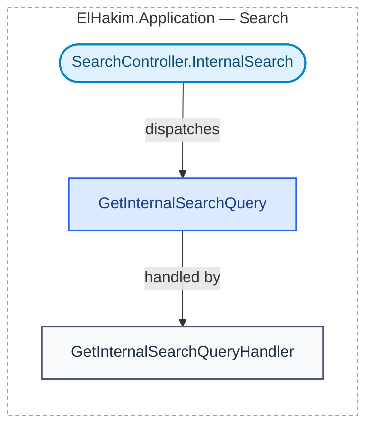
```mermaid
flowchart LR
    accTitle: Flow map
    accDescr: 2 edges, 3 nodes.
    subgraph flow["ElHakim.Application — Search"]
        ep_SearchController_InternalSearch(["SearchController.InternalSearch"]):::clsFlowEndpoint
        req_GetInternalSearchQuery["GetInternalSearchQuery"]:::clsFlowRequest
        hdl_GetInternalSearchQueryHandler["GetInternalSearchQueryHandler"]:::clsFlowHandler
    end
    ep_SearchController_InternalSearch -->|dispatches| req_GetInternalSearchQuery
    req_GetInternalSearchQuery -->|handled by| hdl_GetInternalSearchQueryHandler
    classDef clsFlowEndpoint fill:#e0f2fe,stroke:#0284c7,stroke-width:2px,color:#0c4a6e
    classDef clsFlowRequest fill:#dbeafe,stroke:#2563eb,stroke-width:1.5px,color:#1e3a8a
    classDef clsFlowHandler fill:#f8fafc,stroke:#475569,stroke-width:1.5px,color:#1e293b
    classDef clsFlowNotification fill:#fdf4ff,stroke:#a21caf,stroke-width:2px,color:#4a044e
    classDef clsFlowDbContext fill:#ecfdf5,stroke:#059669,stroke-width:2px,color:#064e3b
    style flow fill:none,stroke:#94a3b8,stroke-dasharray:4 3
```

_2 edges · 1 connected flow_

### ElHakim.Application — Settings — flow

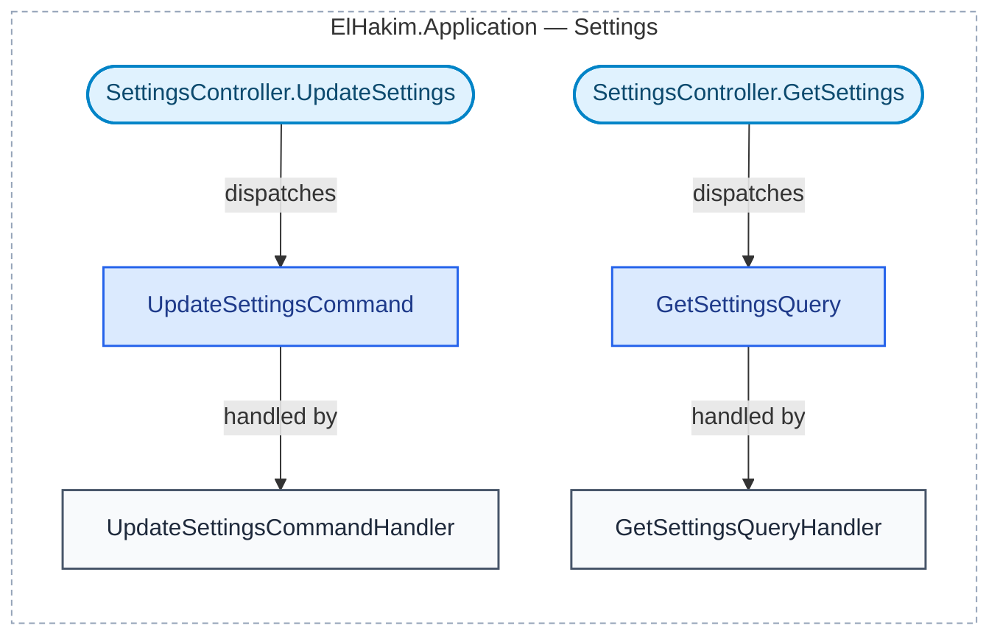
```mermaid
flowchart LR
    accTitle: Flow map
    accDescr: 4 edges, 6 nodes.
    subgraph flow["ElHakim.Application — Settings"]
        ep_SettingsController_GetSettings(["SettingsController.GetSettings"]):::clsFlowEndpoint
        req_GetSettingsQuery["GetSettingsQuery"]:::clsFlowRequest
        ep_SettingsController_UpdateSettings(["SettingsController.UpdateSettings"]):::clsFlowEndpoint
        req_UpdateSettingsCommand["UpdateSettingsCommand"]:::clsFlowRequest
        hdl_UpdateSettingsCommandHandler["UpdateSettingsCommandHandler"]:::clsFlowHandler
        hdl_GetSettingsQueryHandler["GetSettingsQueryHandler"]:::clsFlowHandler
    end
    ep_SettingsController_GetSettings -->|dispatches| req_GetSettingsQuery
    ep_SettingsController_UpdateSettings -->|dispatches| req_UpdateSettingsCommand
    req_UpdateSettingsCommand -->|handled by| hdl_UpdateSettingsCommandHandler
    req_GetSettingsQuery -->|handled by| hdl_GetSettingsQueryHandler
    classDef clsFlowEndpoint fill:#e0f2fe,stroke:#0284c7,stroke-width:2px,color:#0c4a6e
    classDef clsFlowRequest fill:#dbeafe,stroke:#2563eb,stroke-width:1.5px,color:#1e3a8a
    classDef clsFlowHandler fill:#f8fafc,stroke:#475569,stroke-width:1.5px,color:#1e293b
    classDef clsFlowNotification fill:#fdf4ff,stroke:#a21caf,stroke-width:2px,color:#4a044e
    classDef clsFlowDbContext fill:#ecfdf5,stroke:#059669,stroke-width:2px,color:#064e3b
    style flow fill:none,stroke:#94a3b8,stroke-dasharray:4 3
```

_4 edges · 2 connected flows_

### ElHakim.Application — SocialLinks — flow

```mermaid
flowchart LR
    accTitle: Flow map
    accDescr: 9 edges, 13 nodes.
    subgraph flow["ElHakim.Application — SocialLinks"]
        ep_SocialLinksController_Create(["SocialLinksController.Create"]):::clsFlowEndpoint
        req_CreateSocialLinkCommand["CreateSocialLinkCommand"]:::clsFlowRequest
        ep_SocialLinksController_Delete(["SocialLinksController.Delete"]):::clsFlowEndpoint
        req_DeleteSocialLinkCommand["DeleteSocialLinkCommand"]:::clsFlowRequest
        ep_SocialLinksController_Get(["SocialLinksController.Get"]):::clsFlowEndpoint
        req_GetSocialLinksQuery["GetSocialLinksQuery"]:::clsFlowRequest
        ep_SocialLinksController_GetAdmin(["SocialLinksController.GetAdmin"]):::clsFlowEndpoint
        ep_SocialLinksController_Update(["SocialLinksController.Update"]):::clsFlowEndpoint
        req_UpdateSocialLinkCommand["UpdateSocialLinkCommand"]:::clsFlowRequest
        hdl_CreateSocialLinkCommandHandler["CreateSocialLinkCommandHandler"]:::clsFlowHandler
        hdl_DeleteSocialLinkCommandHandler["DeleteSocialLinkCommandHandler"]:::clsFlowHandler
        hdl_UpdateSocialLinkCommandHandler["UpdateSocialLinkCommandHandler"]:::clsFlowHandler
        hdl_GetSocialLinksQueryHandler["GetSocialLinksQueryHandler"]:::clsFlowHandler
    end
    ep_SocialLinksController_Create -->|dispatches| req_CreateSocialLinkCommand
    ep_SocialLinksController_Delete -->|dispatches| req_DeleteSocialLinkCommand
    ep_SocialLinksController_Get -->|dispatches| req_GetSocialLinksQuery
    ep_SocialLinksController_GetAdmin -->|dispatches| req_GetSocialLinksQuery
    ep_SocialLinksController_Update -->|dispatches| req_UpdateSocialLinkCommand
    req_CreateSocialLinkCommand -->|handled by| hdl_CreateSocialLinkCommandHandler
    req_DeleteSocialLinkCommand -->|handled by| hdl_DeleteSocialLinkCommandHandler
    req_UpdateSocialLinkCommand -->|handled by| hdl_UpdateSocialLinkCommandHandler
    req_GetSocialLinksQuery -->|handled by| hdl_GetSocialLinksQueryHandler
    classDef clsFlowEndpoint fill:#e0f2fe,stroke:#0284c7,stroke-width:2px,color:#0c4a6e
    classDef clsFlowRequest fill:#dbeafe,stroke:#2563eb,stroke-width:1.5px,color:#1e3a8a
    classDef clsFlowHandler fill:#f8fafc,stroke:#475569,stroke-width:1.5px,color:#1e293b
    classDef clsFlowNotification fill:#fdf4ff,stroke:#a21caf,stroke-width:2px,color:#4a044e
    classDef clsFlowDbContext fill:#ecfdf5,stroke:#059669,stroke-width:2px,color:#064e3b
    style flow fill:none,stroke:#94a3b8,stroke-dasharray:4 3
```

_9 edges · 4 connected flows_

### ElHakim.Application — Tags — flow

```mermaid
flowchart LR
    accTitle: Flow map
    accDescr: 8 edges, 14 nodes.
    subgraph flow["ElHakim.Application — Tags"]
        ep_TagsController_QuickCreateTag(["TagsController.QuickCreateTag"]):::clsFlowEndpoint
        req_QuickCreateTagCommand["QuickCreateTagCommand"]:::clsFlowRequest
        ep_TagsController_TagDetail(["TagsController.TagDetail"]):::clsFlowEndpoint
        req_GetTagBySlugQuery["GetTagBySlugQuery"]:::clsFlowRequest
        req_CreateTagCommand["CreateTagCommand"]:::clsFlowRequest
        hdl_CreateTagCommandHandler["CreateTagCommandHandler"]:::clsFlowHandler
        req_DeleteTagCommand["DeleteTagCommand"]:::clsFlowRequest
        hdl_DeleteTagCommandHanlder["DeleteTagCommandHanlder"]:::clsFlowHandler
        hdl_QuickCreateTagCommandHandler["QuickCreateTagCommandHandler"]:::clsFlowHandler
        req_UpdateTagCommand["UpdateTagCommand"]:::clsFlowRequest
        hdl_UpdateTagCommandHandler["UpdateTagCommandHandler"]:::clsFlowHandler
        hdl_GetTagBySlugQueryHandler["GetTagBySlugQueryHandler"]:::clsFlowHandler
        req_GetTagsCommand["GetTagsCommand"]:::clsFlowRequest
        hdl_GetTagsCommandHandler["GetTagsCommandHandler"]:::clsFlowHandler
    end
    ep_TagsController_QuickCreateTag -->|dispatches| req_QuickCreateTagCommand
    ep_TagsController_TagDetail -->|dispatches| req_GetTagBySlugQuery
    req_CreateTagCommand -->|handled by| hdl_CreateTagCommandHandler
    req_DeleteTagCommand -->|handled by| hdl_DeleteTagCommandHanlder
    req_QuickCreateTagCommand -->|handled by| hdl_QuickCreateTagCommandHandler
    req_UpdateTagCommand -->|handled by| hdl_UpdateTagCommandHandler
    req_GetTagBySlugQuery -->|handled by| hdl_GetTagBySlugQueryHandler
    req_GetTagsCommand -->|handled by| hdl_GetTagsCommandHandler
    classDef clsFlowEndpoint fill:#e0f2fe,stroke:#0284c7,stroke-width:2px,color:#0c4a6e
    classDef clsFlowRequest fill:#dbeafe,stroke:#2563eb,stroke-width:1.5px,color:#1e3a8a
    classDef clsFlowHandler fill:#f8fafc,stroke:#475569,stroke-width:1.5px,color:#1e293b
    classDef clsFlowNotification fill:#fdf4ff,stroke:#a21caf,stroke-width:2px,color:#4a044e
    classDef clsFlowDbContext fill:#ecfdf5,stroke:#059669,stroke-width:2px,color:#064e3b
    style flow fill:none,stroke:#94a3b8,stroke-dasharray:4 3
```

_8 edges · 6 connected flows_

### ElHakim.Application — UploadMedia — flow

```mermaid
flowchart LR
    accTitle: Flow map
    accDescr: 8 edges, 12 nodes.
    subgraph flow["ElHakim.Application — UploadMedia"]
        ep_MediaController_DeleteMedia(["MediaController.DeleteMedia"]):::clsFlowEndpoint
        req_DeleteMediaCommand["DeleteMediaCommand"]:::clsFlowRequest
        ep_MediaController_GetMediaFiles(["MediaController.GetMediaFiles"]):::clsFlowEndpoint
        req_GetMediaFilesQuery["GetMediaFilesQuery"]:::clsFlowRequest
        ep_MediaController_UploadImage(["MediaController.UploadImage"]):::clsFlowEndpoint
        req_UploadMediaCommand["UploadMediaCommand"]:::clsFlowRequest
        ep_MediaController_UploadSmartImage(["MediaController.UploadSmartImage"]):::clsFlowEndpoint
        req_UploadSmartMediaCommand["UploadSmartMediaCommand"]:::clsFlowRequest
        hdl_DeleteMediaCommandHandler["DeleteMediaCommandHandler"]:::clsFlowHandler
        hdl_GetMediaFilesQueryHandler["GetMediaFilesQueryHandler"]:::clsFlowHandler
        hdl_UploadMediaCommandHandler["UploadMediaCommandHandler"]:::clsFlowHandler
        hdl_UploadSmartMediaCommandHandler["UploadSmartMediaCommandHandler"]:::clsFlowHandler
    end
    ep_MediaController_DeleteMedia -->|dispatches| req_DeleteMediaCommand
    ep_MediaController_GetMediaFiles -->|dispatches| req_GetMediaFilesQuery
    ep_MediaController_UploadImage -->|dispatches| req_UploadMediaCommand
    ep_MediaController_UploadSmartImage -->|dispatches| req_UploadSmartMediaCommand
    req_DeleteMediaCommand -->|handled by| hdl_DeleteMediaCommandHandler
    req_GetMediaFilesQuery -->|handled by| hdl_GetMediaFilesQueryHandler
    req_UploadMediaCommand -->|handled by| hdl_UploadMediaCommandHandler
    req_UploadSmartMediaCommand -->|handled by| hdl_UploadSmartMediaCommandHandler
    classDef clsFlowEndpoint fill:#e0f2fe,stroke:#0284c7,stroke-width:2px,color:#0c4a6e
    classDef clsFlowRequest fill:#dbeafe,stroke:#2563eb,stroke-width:1.5px,color:#1e3a8a
    classDef clsFlowHandler fill:#f8fafc,stroke:#475569,stroke-width:1.5px,color:#1e293b
    classDef clsFlowNotification fill:#fdf4ff,stroke:#a21caf,stroke-width:2px,color:#4a044e
    classDef clsFlowDbContext fill:#ecfdf5,stroke:#059669,stroke-width:2px,color:#064e3b
    style flow fill:none,stroke:#94a3b8,stroke-dasharray:4 3
```

_8 edges · 4 connected flows_

## Request sequences

_One sequence diagram per request with a resolved handler, built only from data the scan model holds. Participants: endpoint → mediator → pipeline behaviors (registered order) → handler → DbContext → published notifications. A DbContext participant appears only when the model holds a handler → DbContext edge; behavior order is registered order, not execution order._

### AutoApplyJobCommand

```mermaid
sequenceDiagram
    %% Request sequence: AutoApplyJobCommand
    participant ep as POST /api/jobs/{id}/auto-apply
    participant m as Mediator
    participant b1 as ValidationBehavior
    participant h1 as AutoApplyJobCommandHandler
    ep->>m: AutoApplyJobCommand
    m->>b1: handle
    b1->>h1: handle
    h1-->>m: response
    m-->>ep: response
    Note over b1: Registered order — execution order is not guaranteed.
```

_Sequence for AutoApplyJobCommand: POST /api/jobs/{id}/auto-apply → mediator → handler. Behaviors shown in registered order (1); execution order is not guaranteed._

### CreateCommentCommand

```mermaid
sequenceDiagram
    %% Request sequence: CreateCommentCommand
    participant ep as POST /api/comments
    participant m as Mediator
    participant b1 as ValidationBehavior
    participant h1 as CreateCommentCommandHandler
    ep->>m: CreateCommentCommand
    m->>b1: handle
    b1->>h1: handle
    h1-->>m: response
    m-->>ep: response
    Note over b1: Registered order — execution order is not guaranteed.
```

_Sequence for CreateCommentCommand: POST /api/comments → mediator → handler. Behaviors shown in registered order (1); execution order is not guaranteed._

### CreateGuestbookEntryCommand

```mermaid
sequenceDiagram
    %% Request sequence: CreateGuestbookEntryCommand
    participant ep as POST /api/guestbook
    participant m as Mediator
    participant b1 as ValidationBehavior
    participant h1 as CreateGuestbookEntryCommandHandler
    ep->>m: CreateGuestbookEntryCommand
    m->>b1: handle
    b1->>h1: handle
    h1-->>m: response
    m-->>ep: response
    Note over b1: Registered order — execution order is not guaranteed.
```

_Sequence for CreateGuestbookEntryCommand: POST /api/guestbook → mediator → handler. Behaviors shown in registered order (1); execution order is not guaranteed._

### CreateManualJobCommand

```mermaid
sequenceDiagram
    %% Request sequence: CreateManualJobCommand
    participant ep as POST /api/jobs/manual
    participant m as Mediator
    participant b1 as ValidationBehavior
    participant h1 as CreateManualJobCommandHandler
    ep->>m: CreateManualJobCommand
    m->>b1: handle
    b1->>h1: handle
    h1-->>m: response
    m-->>ep: response
    Note over b1: Registered order — execution order is not guaranteed.
```

_Sequence for CreateManualJobCommand: POST /api/jobs/manual → mediator → handler. Behaviors shown in registered order (1); execution order is not guaranteed._

### CreatePostCommand

```mermaid
sequenceDiagram
    %% Request sequence: CreatePostCommand
    participant m as Mediator
    participant b1 as ValidationBehavior
    participant h1 as CreatePostCommandHandler
    m->>b1: handle
    b1->>h1: handle
    h1-->>m: response
    Note over b1: Registered order — execution order is not guaranteed.
```

_Sequence for CreatePostCommand: mediator → handler (no endpoint edge in the model). Behaviors shown in registered order (1); execution order is not guaranteed._

### CreatePostRevisionCommand

```mermaid
sequenceDiagram
    %% Request sequence: CreatePostRevisionCommand
    participant ep as POST /api/posts/{id:guid}/revisions
    participant m as Mediator
    participant b1 as ValidationBehavior
    participant h1 as CreatePostRevisionCommandHandler
    ep->>m: CreatePostRevisionCommand
    m->>b1: handle
    b1->>h1: handle
    h1-->>m: response
    m-->>ep: response
    Note over b1: Registered order — execution order is not guaranteed.
```

_Sequence for CreatePostRevisionCommand: POST /api/posts/{id:guid}/revisions → mediator → handler. Behaviors shown in registered order (1); execution order is not guaranteed._

### CreateProjectCommand

```mermaid
sequenceDiagram
    %% Request sequence: CreateProjectCommand
    participant ep as POST /api/projects
    participant m as Mediator
    participant b1 as ValidationBehavior
    participant h1 as CreateProjectCommandHandler
    ep->>m: CreateProjectCommand
    m->>b1: handle
    b1->>h1: handle
    h1-->>m: response
    m-->>ep: response
    Note over b1: Registered order — execution order is not guaranteed.
```

_Sequence for CreateProjectCommand: POST /api/projects → mediator → handler. Behaviors shown in registered order (1); execution order is not guaranteed._

### CreateSocialLinkCommand

```mermaid
sequenceDiagram
    %% Request sequence: CreateSocialLinkCommand
    participant ep as POST /api/sociallinks
    participant m as Mediator
    participant b1 as ValidationBehavior
    participant h1 as CreateSocialLinkCommandHandler
    ep->>m: CreateSocialLinkCommand
    m->>b1: handle
    b1->>h1: handle
    h1-->>m: response
    m-->>ep: response
    Note over b1: Registered order — execution order is not guaranteed.
```

_Sequence for CreateSocialLinkCommand: POST /api/sociallinks → mediator → handler. Behaviors shown in registered order (1); execution order is not guaranteed._

### CreateTagCommand

```mermaid
sequenceDiagram
    %% Request sequence: CreateTagCommand
    participant m as Mediator
    participant b1 as ValidationBehavior
    participant h1 as CreateTagCommandHandler
    m->>b1: handle
    b1->>h1: handle
    h1-->>m: response
    Note over b1: Registered order — execution order is not guaranteed.
```

_Sequence for CreateTagCommand: mediator → handler (no endpoint edge in the model). Behaviors shown in registered order (1); execution order is not guaranteed._

### DeleteMediaCommand

```mermaid
sequenceDiagram
    %% Request sequence: DeleteMediaCommand
    participant ep as DELETE /api/media/{id:guid}
    participant m as Mediator
    participant b1 as ValidationBehavior
    participant h1 as DeleteMediaCommandHandler
    ep->>m: DeleteMediaCommand
    m->>b1: handle
    b1->>h1: handle
    h1-->>m: response
    m-->>ep: response
    Note over b1: Registered order — execution order is not guaranteed.
```

_Sequence for DeleteMediaCommand: DELETE /api/media/{id:guid} → mediator → handler. Behaviors shown in registered order (1); execution order is not guaranteed._

### DeletePostCommand

```mermaid
sequenceDiagram
    %% Request sequence: DeletePostCommand
    participant ep as DELETE /api/posts/{id}
    participant m as Mediator
    participant b1 as ValidationBehavior
    participant h1 as DeletePostCommandHandler
    ep->>m: DeletePostCommand
    m->>b1: handle
    b1->>h1: handle
    h1-->>m: response
    m-->>ep: response
    Note over b1: Registered order — execution order is not guaranteed.
```

_Sequence for DeletePostCommand: DELETE /api/posts/{id} → mediator → handler. Behaviors shown in registered order (1); execution order is not guaranteed._

### DeleteProjectCommand

```mermaid
sequenceDiagram
    %% Request sequence: DeleteProjectCommand
    participant ep as DELETE /api/projects/{id:guid}
    participant m as Mediator
    participant b1 as ValidationBehavior
    participant h1 as DeleteProjectCommandHandler
    ep->>m: DeleteProjectCommand
    m->>b1: handle
    b1->>h1: handle
    h1-->>m: response
    m-->>ep: response
    Note over b1: Registered order — execution order is not guaranteed.
```

_Sequence for DeleteProjectCommand: DELETE /api/projects/{id:guid} → mediator → handler. Behaviors shown in registered order (1); execution order is not guaranteed._

### DeleteSocialLinkCommand

```mermaid
sequenceDiagram
    %% Request sequence: DeleteSocialLinkCommand
    participant ep as DELETE /api/sociallinks/{id:guid}
    participant m as Mediator
    participant b1 as ValidationBehavior
    participant h1 as DeleteSocialLinkCommandHandler
    ep->>m: DeleteSocialLinkCommand
    m->>b1: handle
    b1->>h1: handle
    h1-->>m: response
    m-->>ep: response
    Note over b1: Registered order — execution order is not guaranteed.
```

_Sequence for DeleteSocialLinkCommand: DELETE /api/sociallinks/{id:guid} → mediator → handler. Behaviors shown in registered order (1); execution order is not guaranteed._

### DeleteTagCommand

```mermaid
sequenceDiagram
    %% Request sequence: DeleteTagCommand
    participant m as Mediator
    participant b1 as ValidationBehavior
    participant h1 as DeleteTagCommandHanlder
    m->>b1: handle
    b1->>h1: handle
    h1-->>m: response
    Note over b1: Registered order — execution order is not guaranteed.
```

_Sequence for DeleteTagCommand: mediator → handler (no endpoint edge in the model). Behaviors shown in registered order (1); execution order is not guaranteed._

### GetAdminCommentsQuery

```mermaid
sequenceDiagram
    %% Request sequence: GetAdminCommentsQuery
    participant ep as GET /api/admin/comments
    participant m as Mediator
    participant b1 as ValidationBehavior
    participant h1 as GetAdminCommentsQueryHandler
    ep->>m: GetAdminCommentsQuery
    m->>b1: handle
    b1->>h1: handle
    h1-->>m: response
    m-->>ep: response
    Note over b1: Registered order — execution order is not guaranteed.
```

_Sequence for GetAdminCommentsQuery: GET /api/admin/comments → mediator → handler. Behaviors shown in registered order (1); execution order is not guaranteed._

### GetAdminRecentActivityQuery

```mermaid
sequenceDiagram
    %% Request sequence: GetAdminRecentActivityQuery
    participant ep as GET /api/analytics/recent-activity
    participant m as Mediator
    participant b1 as ValidationBehavior
    participant h1 as GetAdminRecentActivityQueryHandler
    ep->>m: GetAdminRecentActivityQuery
    m->>b1: handle
    b1->>h1: handle
    h1-->>m: response
    m-->>ep: response
    Note over b1: Registered order — execution order is not guaranteed.
```

_Sequence for GetAdminRecentActivityQuery: GET /api/analytics/recent-activity → mediator → handler. Behaviors shown in registered order (1); execution order is not guaranteed._

### GetAdminUsersQuery

```mermaid
sequenceDiagram
    %% Request sequence: GetAdminUsersQuery
    participant ep as GET /api/admin/users
    participant m as Mediator
    participant b1 as ValidationBehavior
    participant h1 as GetAdminUsersQueryHandler
    ep->>m: GetAdminUsersQuery
    m->>b1: handle
    b1->>h1: handle
    h1-->>m: response
    m-->>ep: response
    Note over b1: Registered order — execution order is not guaranteed.
```

_Sequence for GetAdminUsersQuery: GET /api/admin/users → mediator → handler. Behaviors shown in registered order (1); execution order is not guaranteed._

### GetCommentStatsQuery

```mermaid
sequenceDiagram
    %% Request sequence: GetCommentStatsQuery
    participant ep as GET /api/comments/stats
    participant m as Mediator
    participant b1 as ValidationBehavior
    participant h1 as GetCommentStatsQueryHandler
    ep->>m: GetCommentStatsQuery
    m->>b1: handle
    b1->>h1: handle
    h1-->>m: response
    m-->>ep: response
    Note over b1: Registered order — execution order is not guaranteed.
```

_Sequence for GetCommentStatsQuery: GET /api/comments/stats → mediator → handler. Behaviors shown in registered order (1); execution order is not guaranteed._

### GetDashboardAnalyticsQuery

```mermaid
sequenceDiagram
    %% Request sequence: GetDashboardAnalyticsQuery
    participant ep as GET /api/analytics/dashboard
    participant m as Mediator
    participant b1 as ValidationBehavior
    participant h1 as GetDashboardAnalyticsQueryHandler
    ep->>m: GetDashboardAnalyticsQuery
    m->>b1: handle
    b1->>h1: handle
    h1-->>m: response
    m-->>ep: response
    Note over b1: Registered order — execution order is not guaranteed.
```

_Sequence for GetDashboardAnalyticsQuery: GET /api/analytics/dashboard → mediator → handler. Behaviors shown in registered order (1); execution order is not guaranteed._

### GetInternalSearchQuery

```mermaid
sequenceDiagram
    %% Request sequence: GetInternalSearchQuery
    participant ep as GET /api/search/internal
    participant m as Mediator
    participant b1 as ValidationBehavior
    participant h1 as GetInternalSearchQueryHandler
    ep->>m: GetInternalSearchQuery
    m->>b1: handle
    b1->>h1: handle
    h1-->>m: response
    m-->>ep: response
    Note over b1: Registered order — execution order is not guaranteed.
```

_Sequence for GetInternalSearchQuery: GET /api/search/internal → mediator → handler. Behaviors shown in registered order (1); execution order is not guaranteed._

### GetJobApplicationsQuery

```mermaid
sequenceDiagram
    %% Request sequence: GetJobApplicationsQuery
    participant ep as GET /api/jobs
    participant m as Mediator
    participant b1 as ValidationBehavior
    participant h1 as GetJobApplicationsQueryHandler
    ep->>m: GetJobApplicationsQuery
    m->>b1: handle
    b1->>h1: handle
    h1-->>m: response
    m-->>ep: response
    Note over b1: Registered order — execution order is not guaranteed.
```

_Sequence for GetJobApplicationsQuery: GET /api/jobs → mediator → handler. Behaviors shown in registered order (1); execution order is not guaranteed._

### GetMediaFilesQuery

```mermaid
sequenceDiagram
    %% Request sequence: GetMediaFilesQuery
    participant ep as GET /api/media
    participant m as Mediator
    participant b1 as ValidationBehavior
    participant h1 as GetMediaFilesQueryHandler
    ep->>m: GetMediaFilesQuery
    m->>b1: handle
    b1->>h1: handle
    h1-->>m: response
    m-->>ep: response
    Note over b1: Registered order — execution order is not guaranteed.
```

_Sequence for GetMediaFilesQuery: GET /api/media → mediator → handler. Behaviors shown in registered order (1); execution order is not guaranteed._

### GetPageBySlugQuery

```mermaid
sequenceDiagram
    %% Request sequence: GetPageBySlugQuery
    participant ep as GET /api/pages/detail
    participant m as Mediator
    participant b1 as ValidationBehavior
    participant h1 as GetPageBySlugQueryHandler
    ep->>m: GetPageBySlugQuery
    m->>b1: handle
    b1->>h1: handle
    h1-->>m: response
    m-->>ep: response
    Note over b1: Registered order — execution order is not guaranteed.
```

_Sequence for GetPageBySlugQuery: GET /api/pages/detail → mediator → handler. Behaviors shown in registered order (1); execution order is not guaranteed._

### GetPostBySlugQuery

```mermaid
sequenceDiagram
    %% Request sequence: GetPostBySlugQuery
    participant ep as GET /api/posts/detail
    participant m as Mediator
    participant b1 as ValidationBehavior
    participant h1 as GetPostBySlugQueryHandler
    ep->>m: GetPostBySlugQuery
    m->>b1: handle
    b1->>h1: handle
    h1-->>m: response
    m-->>ep: response
    Note over b1: Registered order — execution order is not guaranteed.
```

_Sequence for GetPostBySlugQuery: GET /api/posts/detail → mediator → handler. Behaviors shown in registered order (1); execution order is not guaranteed._

### GetPostCommentsQuery

```mermaid
sequenceDiagram
    %% Request sequence: GetPostCommentsQuery
    participant ep as GET /api/comments
    participant m as Mediator
    participant b1 as ValidationBehavior
    participant h1 as GetPostCommentsQueryHandler
    ep->>m: GetPostCommentsQuery
    m->>b1: handle
    b1->>h1: handle
    h1-->>m: response
    m-->>ep: response
    Note over b1: Registered order — execution order is not guaranteed.
```

_Sequence for GetPostCommentsQuery: GET /api/comments → mediator → handler. Behaviors shown in registered order (1); execution order is not guaranteed._

### GetPostLikeStatusQuery

```mermaid
sequenceDiagram
    %% Request sequence: GetPostLikeStatusQuery
    participant ep as GET /api/likes/post/{postId}
    participant m as Mediator
    participant b1 as ValidationBehavior
    participant h1 as GetPostLikeStatusQueryHandler
    ep->>m: GetPostLikeStatusQuery
    m->>b1: handle
    b1->>h1: handle
    h1-->>m: response
    m-->>ep: response
    Note over b1: Registered order — execution order is not guaranteed.
```

_Sequence for GetPostLikeStatusQuery: GET /api/likes/post/{postId} → mediator → handler. Behaviors shown in registered order (1); execution order is not guaranteed._

### GetPostRevisionsQuery

```mermaid
sequenceDiagram
    %% Request sequence: GetPostRevisionsQuery
    participant ep as GET /api/posts/{id:guid}/revisions
    participant m as Mediator
    participant b1 as ValidationBehavior
    participant h1 as GetPostRevisionsQueryHandler
    ep->>m: GetPostRevisionsQuery
    m->>b1: handle
    b1->>h1: handle
    h1-->>m: response
    m-->>ep: response
    Note over b1: Registered order — execution order is not guaranteed.
```

_Sequence for GetPostRevisionsQuery: GET /api/posts/{id:guid}/revisions → mediator → handler. Behaviors shown in registered order (1); execution order is not guaranteed._

### GetPostSlugsQuery

```mermaid
sequenceDiagram
    %% Request sequence: GetPostSlugsQuery
    participant ep as GET /api/posts/slugs
    participant m as Mediator
    participant b1 as ValidationBehavior
    participant h1 as GetPostSlugsQueryHandler
    ep->>m: GetPostSlugsQuery
    m->>b1: handle
    b1->>h1: handle
    h1-->>m: response
    m-->>ep: response
    Note over b1: Registered order — execution order is not guaranteed.
```

_Sequence for GetPostSlugsQuery: GET /api/posts/slugs → mediator → handler. Behaviors shown in registered order (1); execution order is not guaranteed._

### GetPostsQuery

```mermaid
sequenceDiagram
    %% Request sequence: GetPostsQuery
    participant m as Mediator
    participant b1 as ValidationBehavior
    participant h1 as GetPostsQueryHandler
    m->>b1: handle
    b1->>h1: handle
    h1-->>m: response
    Note over b1: Registered order — execution order is not guaranteed.
```

_Sequence for GetPostsQuery: mediator → handler (no endpoint edge in the model). Behaviors shown in registered order (1); execution order is not guaranteed._

### GetProjectBySlugQuery

```mermaid
sequenceDiagram
    %% Request sequence: GetProjectBySlugQuery
    participant ep as GET /api/projects/admin/detail
    participant m as Mediator
    participant b1 as ValidationBehavior
    participant h1 as GetProjectBySlugQueryHandler
    ep->>m: GetProjectBySlugQuery
    m->>b1: handle
    b1->>h1: handle
    h1-->>m: response
    m-->>ep: response
    Note over b1: Registered order — execution order is not guaranteed.
```

_Sequence for GetProjectBySlugQuery: GET /api/projects/admin/detail → mediator → handler. Behaviors shown in registered order (1); execution order is not guaranteed._

### GetProjectLikeStatusQuery

```mermaid
sequenceDiagram
    %% Request sequence: GetProjectLikeStatusQuery
    participant ep as GET /api/likes/project/{projectId}
    participant m as Mediator
    participant b1 as ValidationBehavior
    participant h1 as GetProjectLikeStatusQueryHandler
    ep->>m: GetProjectLikeStatusQuery
    m->>b1: handle
    b1->>h1: handle
    h1-->>m: response
    m-->>ep: response
    Note over b1: Registered order — execution order is not guaranteed.
```

_Sequence for GetProjectLikeStatusQuery: GET /api/likes/project/{projectId} → mediator → handler. Behaviors shown in registered order (1); execution order is not guaranteed._

### GetProjectsQuery

```mermaid
sequenceDiagram
    %% Request sequence: GetProjectsQuery
    participant ep as GET /api/projects
    participant m as Mediator
    participant b1 as ValidationBehavior
    participant h1 as GetProjectsQueryHandler
    ep->>m: GetProjectsQuery
    m->>b1: handle
    b1->>h1: handle
    h1-->>m: response
    m-->>ep: response
    Note over b1: Registered order — execution order is not guaranteed.
```

_Sequence for GetProjectsQuery: GET /api/projects → mediator → handler. Behaviors shown in registered order (1); execution order is not guaranteed._

### GetSettingsQuery

```mermaid
sequenceDiagram
    %% Request sequence: GetSettingsQuery
    participant ep as GET /api/settings
    participant m as Mediator
    participant b1 as ValidationBehavior
    participant h1 as GetSettingsQueryHandler
    ep->>m: GetSettingsQuery
    m->>b1: handle
    b1->>h1: handle
    h1-->>m: response
    m-->>ep: response
    Note over b1: Registered order — execution order is not guaranteed.
```

_Sequence for GetSettingsQuery: GET /api/settings → mediator → handler. Behaviors shown in registered order (1); execution order is not guaranteed._

### GetSocialActivityQuery

```mermaid
sequenceDiagram
    %% Request sequence: GetSocialActivityQuery
    participant ep as GET /api/external/news
    participant m as Mediator
    participant b1 as ValidationBehavior
    participant h1 as GetSocialActivityQueryHandler
    ep->>m: GetSocialActivityQuery
    m->>b1: handle
    b1->>h1: handle
    h1-->>m: response
    m-->>ep: response
    Note over b1: Registered order — execution order is not guaranteed.
```

_Sequence for GetSocialActivityQuery: GET /api/external/news → mediator → handler. Behaviors shown in registered order (1); execution order is not guaranteed._

### GetSocialLinksQuery

```mermaid
sequenceDiagram
    %% Request sequence: GetSocialLinksQuery
    participant ep as GET /api/sociallinks
    participant m as Mediator
    participant b1 as ValidationBehavior
    participant h1 as GetSocialLinksQueryHandler
    ep->>m: GetSocialLinksQuery
    m->>b1: handle
    b1->>h1: handle
    h1-->>m: response
    m-->>ep: response
    Note over b1: Registered order — execution order is not guaranteed.
```

_Sequence for GetSocialLinksQuery: GET /api/sociallinks → mediator → handler. Behaviors shown in registered order (1); execution order is not guaranteed._

### GetTagBySlugQuery

```mermaid
sequenceDiagram
    %% Request sequence: GetTagBySlugQuery
    participant ep as GET /api/tags/{slug}
    participant m as Mediator
    participant b1 as ValidationBehavior
    participant h1 as GetTagBySlugQueryHandler
    ep->>m: GetTagBySlugQuery
    m->>b1: handle
    b1->>h1: handle
    h1-->>m: response
    m-->>ep: response
    Note over b1: Registered order — execution order is not guaranteed.
```

_Sequence for GetTagBySlugQuery: GET /api/tags/{slug} → mediator → handler. Behaviors shown in registered order (1); execution order is not guaranteed._

### GetTagsCommand

```mermaid
sequenceDiagram
    %% Request sequence: GetTagsCommand
    participant m as Mediator
    participant b1 as ValidationBehavior
    participant h1 as GetTagsCommandHandler
    m->>b1: handle
    b1->>h1: handle
    h1-->>m: response
    Note over b1: Registered order — execution order is not guaranteed.
```

_Sequence for GetTagsCommand: mediator → handler (no endpoint edge in the model). Behaviors shown in registered order (1); execution order is not guaranteed._

### GetWakaTimeStatsQuery

```mermaid
sequenceDiagram
    %% Request sequence: GetWakaTimeStatsQuery
    participant ep as GET /api/external/wakatime
    participant m as Mediator
    participant b1 as ValidationBehavior
    participant h1 as GetWakaTimeStatsQueryHandler
    ep->>m: GetWakaTimeStatsQuery
    m->>b1: handle
    b1->>h1: handle
    h1-->>m: response
    m-->>ep: response
    Note over b1: Registered order — execution order is not guaranteed.
```

_Sequence for GetWakaTimeStatsQuery: GET /api/external/wakatime → mediator → handler. Behaviors shown in registered order (1); execution order is not guaranteed._

### ListGuestbookEntriesQuery

```mermaid
sequenceDiagram
    %% Request sequence: ListGuestbookEntriesQuery
    participant ep as GET /api/guestbook
    participant m as Mediator
    participant b1 as ValidationBehavior
    participant h1 as ListGuestbookEntriesQueryHandler
    ep->>m: ListGuestbookEntriesQuery
    m->>b1: handle
    b1->>h1: handle
    h1-->>m: response
    m-->>ep: response
    Note over b1: Registered order — execution order is not guaranteed.
```

_Sequence for ListGuestbookEntriesQuery: GET /api/guestbook → mediator → handler. Behaviors shown in registered order (1); execution order is not guaranteed._

### LoginCommand

```mermaid
sequenceDiagram
    %% Request sequence: LoginCommand
    participant ep as POST /api/auth/Login
    participant m as Mediator
    participant b1 as ValidationBehavior
    participant h1 as LoginCommandHandler
    ep->>m: LoginCommand
    m->>b1: handle
    b1->>h1: handle
    h1-->>m: response
    m-->>ep: response
    Note over b1: Registered order — execution order is not guaranteed.
```

_Sequence for LoginCommand: POST /api/auth/Login → mediator → handler. Behaviors shown in registered order (1); execution order is not guaranteed._

### MarkAppliedCommand

```mermaid
sequenceDiagram
    %% Request sequence: MarkAppliedCommand
    participant ep as POST /api/jobs/{id}/mark-applied
    participant m as Mediator
    participant b1 as ValidationBehavior
    participant h1 as MarkAppliedCommandHandler
    ep->>m: MarkAppliedCommand
    m->>b1: handle
    b1->>h1: handle
    h1-->>m: response
    m-->>ep: response
    Note over b1: Registered order — execution order is not guaranteed.
```

_Sequence for MarkAppliedCommand: POST /api/jobs/{id}/mark-applied → mediator → handler. Behaviors shown in registered order (1); execution order is not guaranteed._

### PublishPostCommand

```mermaid
sequenceDiagram
    %% Request sequence: PublishPostCommand
    participant ep as PATCH /api/posts/publish
    participant m as Mediator
    participant b1 as ValidationBehavior
    participant h1 as PublishPostCommandHandler
    ep->>m: PublishPostCommand
    m->>b1: handle
    b1->>h1: handle
    h1-->>m: response
    m-->>ep: response
    Note over b1: Registered order — execution order is not guaranteed.
```

_Sequence for PublishPostCommand: PATCH /api/posts/publish → mediator → handler. Behaviors shown in registered order (1); execution order is not guaranteed._

### QuickCreateTagCommand

```mermaid
sequenceDiagram
    %% Request sequence: QuickCreateTagCommand
    participant ep as POST /api/tags/quick-create
    participant m as Mediator
    participant b1 as ValidationBehavior
    participant h1 as QuickCreateTagCommandHandler
    ep->>m: QuickCreateTagCommand
    m->>b1: handle
    b1->>h1: handle
    h1-->>m: response
    m-->>ep: response
    Note over b1: Registered order — execution order is not guaranteed.
```

_Sequence for QuickCreateTagCommand: POST /api/tags/quick-create → mediator → handler. Behaviors shown in registered order (1); execution order is not guaranteed._

### RefreshTokenCommand

```mermaid
sequenceDiagram
    %% Request sequence: RefreshTokenCommand
    participant ep as POST /api/auth/refresh
    participant m as Mediator
    participant b1 as ValidationBehavior
    participant h1 as RefreshTokenCommandHandler
    ep->>m: RefreshTokenCommand
    m->>b1: handle
    b1->>h1: handle
    h1-->>m: response
    m-->>ep: response
    Note over b1: Registered order — execution order is not guaranteed.
```

_Sequence for RefreshTokenCommand: POST /api/auth/refresh → mediator → handler. Behaviors shown in registered order (1); execution order is not guaranteed._

### SendDirectMailCommand

```mermaid
sequenceDiagram
    %% Request sequence: SendDirectMailCommand
    participant ep as POST /api/jobs/{id}/send-mail
    participant m as Mediator
    participant b1 as ValidationBehavior
    participant h1 as SendDirectMailCommandHandler
    ep->>m: SendDirectMailCommand
    m->>b1: handle
    b1->>h1: handle
    h1-->>m: response
    m-->>ep: response
    Note over b1: Registered order — execution order is not guaranteed.
```

_Sequence for SendDirectMailCommand: POST /api/jobs/{id}/send-mail → mediator → handler. Behaviors shown in registered order (1); execution order is not guaranteed._

### ToggleCommentVoteCommand

```mermaid
sequenceDiagram
    %% Request sequence: ToggleCommentVoteCommand
    participant ep as POST /api/comments/{commentId:guid}/vote
    participant m as Mediator
    participant b1 as ValidationBehavior
    participant h1 as ToggleCommentVoteCommandHandler
    ep->>m: ToggleCommentVoteCommand
    m->>b1: handle
    b1->>h1: handle
    h1-->>m: response
    m-->>ep: response
    Note over b1: Registered order — execution order is not guaranteed.
```

_Sequence for ToggleCommentVoteCommand: POST /api/comments/{commentId:guid}/vote → mediator → handler. Behaviors shown in registered order (1); execution order is not guaranteed._

### ToggleGuestbookPinCommand

```mermaid
sequenceDiagram
    %% Request sequence: ToggleGuestbookPinCommand
    participant ep as PUT /api/guestbook/{id:guid}/pin
    participant m as Mediator
    participant b1 as ValidationBehavior
    participant h1 as ToggleGuestbookPinCommandHandler
    ep->>m: ToggleGuestbookPinCommand
    m->>b1: handle
    b1->>h1: handle
    h1-->>m: response
    m-->>ep: response
    Note over b1: Registered order — execution order is not guaranteed.
```

_Sequence for ToggleGuestbookPinCommand: PUT /api/guestbook/{id:guid}/pin → mediator → handler. Behaviors shown in registered order (1); execution order is not guaranteed._

### TogglePostLikeCommand

```mermaid
sequenceDiagram
    %% Request sequence: TogglePostLikeCommand
    participant ep as POST /api/likes/post/{postId}/toggle
    participant m as Mediator
    participant b1 as ValidationBehavior
    participant h1 as TogglePostLikeCommandHandler
    ep->>m: TogglePostLikeCommand
    m->>b1: handle
    b1->>h1: handle
    h1-->>m: response
    m-->>ep: response
    Note over b1: Registered order — execution order is not guaranteed.
```

_Sequence for TogglePostLikeCommand: POST /api/likes/post/{postId}/toggle → mediator → handler. Behaviors shown in registered order (1); execution order is not guaranteed._

### TogglePostLikeCommand

```mermaid
sequenceDiagram
    %% Request sequence: TogglePostLikeCommand
    participant ep as POST /api/posts/{slug}/like
    participant m as Mediator
    participant b1 as ValidationBehavior
    participant h1 as TogglePostLikeCommandHandler
    ep->>m: TogglePostLikeCommand
    m->>b1: handle
    b1->>h1: handle
    h1-->>m: response
    m-->>ep: response
    Note over b1: Registered order — execution order is not guaranteed.
```

_Sequence for TogglePostLikeCommand: POST /api/posts/{slug}/like → mediator → handler. Behaviors shown in registered order (1); execution order is not guaranteed._

### ToggleProjectLikeCommand

```mermaid
sequenceDiagram
    %% Request sequence: ToggleProjectLikeCommand
    participant ep as POST /api/likes/project/{projectId}/toggle
    participant m as Mediator
    participant b1 as ValidationBehavior
    participant h1 as ToggleProjectLikeCommandHandler
    ep->>m: ToggleProjectLikeCommand
    m->>b1: handle
    b1->>h1: handle
    h1-->>m: response
    m-->>ep: response
    Note over b1: Registered order — execution order is not guaranteed.
```

_Sequence for ToggleProjectLikeCommand: POST /api/likes/project/{projectId}/toggle → mediator → handler. Behaviors shown in registered order (1); execution order is not guaranteed._

### ToggleUserBlockCommand

```mermaid
sequenceDiagram
    %% Request sequence: ToggleUserBlockCommand
    participant ep as PATCH /api/admin/users/{id:guid}/block
    participant m as Mediator
    participant b1 as ValidationBehavior
    participant h1 as ToggleUserBlockCommandHandler
    ep->>m: ToggleUserBlockCommand
    m->>b1: handle
    b1->>h1: handle
    h1-->>m: response
    m-->>ep: response
    Note over b1: Registered order — execution order is not guaranteed.
```

_Sequence for ToggleUserBlockCommand: PATCH /api/admin/users/{id:guid}/block → mediator → handler. Behaviors shown in registered order (1); execution order is not guaranteed._

### TrackPageViewCommand

```mermaid
sequenceDiagram
    %% Request sequence: TrackPageViewCommand
    participant ep as POST /api/analytics/viewpage
    participant m as Mediator
    participant b1 as ValidationBehavior
    participant h1 as TrackPageViewCommandHandler
    ep->>m: TrackPageViewCommand
    m->>b1: handle
    b1->>h1: handle
    h1-->>m: response
    m-->>ep: response
    Note over b1: Registered order — execution order is not guaranteed.
```

_Sequence for TrackPageViewCommand: POST /api/analytics/viewpage → mediator → handler. Behaviors shown in registered order (1); execution order is not guaranteed._

### UpdateCommentStatusCommand

```mermaid
sequenceDiagram
    %% Request sequence: UpdateCommentStatusCommand
    participant ep as PATCH /api/admin/comments/{id:guid}/status
    participant m as Mediator
    participant b1 as ValidationBehavior
    participant h1 as UpdateCommentStatusCommandHandler
    ep->>m: UpdateCommentStatusCommand
    m->>b1: handle
    b1->>h1: handle
    h1-->>m: response
    m-->>ep: response
    Note over b1: Registered order — execution order is not guaranteed.
```

_Sequence for UpdateCommentStatusCommand: PATCH /api/admin/comments/{id:guid}/status → mediator → handler. Behaviors shown in registered order (1); execution order is not guaranteed._

### UpdatePageCommand

```mermaid
sequenceDiagram
    %% Request sequence: UpdatePageCommand
    participant ep as PUT /api/pages/{slug}
    participant m as Mediator
    participant b1 as ValidationBehavior
    participant h1 as UpdatePageCommandHandler
    ep->>m: UpdatePageCommand
    m->>b1: handle
    b1->>h1: handle
    h1-->>m: response
    m-->>ep: response
    Note over b1: Registered order — execution order is not guaranteed.
```

_Sequence for UpdatePageCommand: PUT /api/pages/{slug} → mediator → handler. Behaviors shown in registered order (1); execution order is not guaranteed._

### UpdatePostCommand

```mermaid
sequenceDiagram
    %% Request sequence: UpdatePostCommand
    participant ep as PUT /api/posts/update
    participant m as Mediator
    participant b1 as ValidationBehavior
    participant h1 as UpdatePostCommandHandler
    ep->>m: UpdatePostCommand
    m->>b1: handle
    b1->>h1: handle
    h1-->>m: response
    m-->>ep: response
    Note over b1: Registered order — execution order is not guaranteed.
```

_Sequence for UpdatePostCommand: PUT /api/posts/update → mediator → handler. Behaviors shown in registered order (1); execution order is not guaranteed._

### UpdatePostStatusCommand

```mermaid
sequenceDiagram
    %% Request sequence: UpdatePostStatusCommand
    participant ep as PATCH /api/posts/{id:guid}/status
    participant m as Mediator
    participant b1 as ValidationBehavior
    participant h1 as UpdatePostStatusCommandHandler
    ep->>m: UpdatePostStatusCommand
    m->>b1: handle
    b1->>h1: handle
    h1-->>m: response
    m-->>ep: response
    Note over b1: Registered order — execution order is not guaranteed.
```

_Sequence for UpdatePostStatusCommand: PATCH /api/posts/{id:guid}/status → mediator → handler. Behaviors shown in registered order (1); execution order is not guaranteed._

### UpdateProjectCommand

```mermaid
sequenceDiagram
    %% Request sequence: UpdateProjectCommand
    participant ep as PUT /api/projects/{id:guid}
    participant m as Mediator
    participant b1 as ValidationBehavior
    participant h1 as UpdateProjectCommandHandler
    ep->>m: UpdateProjectCommand
    m->>b1: handle
    b1->>h1: handle
    h1-->>m: response
    m-->>ep: response
    Note over b1: Registered order — execution order is not guaranteed.
```

_Sequence for UpdateProjectCommand: PUT /api/projects/{id:guid} → mediator → handler. Behaviors shown in registered order (1); execution order is not guaranteed._

### UpdateProjectStatusCommand

```mermaid
sequenceDiagram
    %% Request sequence: UpdateProjectStatusCommand
    participant ep as PATCH /api/projects/{id:guid}/status
    participant m as Mediator
    participant b1 as ValidationBehavior
    participant h1 as UpdateProjectStatusCommandHandler
    ep->>m: UpdateProjectStatusCommand
    m->>b1: handle
    b1->>h1: handle
    h1-->>m: response
    m-->>ep: response
    Note over b1: Registered order — execution order is not guaranteed.
```

_Sequence for UpdateProjectStatusCommand: PATCH /api/projects/{id:guid}/status → mediator → handler. Behaviors shown in registered order (1); execution order is not guaranteed._

### UpdateSettingsCommand

```mermaid
sequenceDiagram
    %% Request sequence: UpdateSettingsCommand
    participant ep as PUT /api/settings
    participant m as Mediator
    participant b1 as ValidationBehavior
    participant h1 as UpdateSettingsCommandHandler
    ep->>m: UpdateSettingsCommand
    m->>b1: handle
    b1->>h1: handle
    h1-->>m: response
    m-->>ep: response
    Note over b1: Registered order — execution order is not guaranteed.
```

_Sequence for UpdateSettingsCommand: PUT /api/settings → mediator → handler. Behaviors shown in registered order (1); execution order is not guaranteed._

### UpdateSocialLinkCommand

```mermaid
sequenceDiagram
    %% Request sequence: UpdateSocialLinkCommand
    participant ep as PUT /api/sociallinks/{id:guid}
    participant m as Mediator
    participant b1 as ValidationBehavior
    participant h1 as UpdateSocialLinkCommandHandler
    ep->>m: UpdateSocialLinkCommand
    m->>b1: handle
    b1->>h1: handle
    h1-->>m: response
    m-->>ep: response
    Note over b1: Registered order — execution order is not guaranteed.
```

_Sequence for UpdateSocialLinkCommand: PUT /api/sociallinks/{id:guid} → mediator → handler. Behaviors shown in registered order (1); execution order is not guaranteed._

### UpdateTagCommand

```mermaid
sequenceDiagram
    %% Request sequence: UpdateTagCommand
    participant m as Mediator
    participant b1 as ValidationBehavior
    participant h1 as UpdateTagCommandHandler
    m->>b1: handle
    b1->>h1: handle
    h1-->>m: response
    Note over b1: Registered order — execution order is not guaranteed.
```

_Sequence for UpdateTagCommand: mediator → handler (no endpoint edge in the model). Behaviors shown in registered order (1); execution order is not guaranteed._

### UploadMediaCommand

```mermaid
sequenceDiagram
    %% Request sequence: UploadMediaCommand
    participant ep as POST /api/media/upload
    participant m as Mediator
    participant b1 as ValidationBehavior
    participant h1 as UploadMediaCommandHandler
    ep->>m: UploadMediaCommand
    m->>b1: handle
    b1->>h1: handle
    h1-->>m: response
    m-->>ep: response
    Note over b1: Registered order — execution order is not guaranteed.
```

_Sequence for UploadMediaCommand: POST /api/media/upload → mediator → handler. Behaviors shown in registered order (1); execution order is not guaranteed._

### UploadSmartMediaCommand

```mermaid
sequenceDiagram
    %% Request sequence: UploadSmartMediaCommand
    participant ep as POST /api/media/upload-smart
    participant m as Mediator
    participant b1 as ValidationBehavior
    participant h1 as UploadSmartMediaCommandHandler
    ep->>m: UploadSmartMediaCommand
    m->>b1: handle
    b1->>h1: handle
    h1-->>m: response
    m-->>ep: response
    Note over b1: Registered order — execution order is not guaranteed.
```

_Sequence for UploadSmartMediaCommand: POST /api/media/upload-smart → mediator → handler. Behaviors shown in registered order (1); execution order is not guaranteed._

## API Endpoints

_The HTTP surface and the request each endpoint dispatches to. `inferred` marks a route or verb guessed from naming rather than read from source; an `unresolved` target has no matching request in the model._

**60 endpoint(s)** across 1 project(s).

| Method | Route | Endpoint | Project | Target request | Handler | Inferred |
| --- | --- | --- | --- | --- | --- | :---: |
| GET | /api/admin/comments | AdminCommentsController.List | ElHakim.Api | GetAdminCommentsQuery | GetAdminCommentsQueryHandler | — |
| PATCH | /api/admin/comments/{id:guid}/status | AdminCommentsController.UpdateStatus | ElHakim.Api | UpdateCommentStatusCommand | UpdateCommentStatusCommandHandler | — |
| GET | /api/admin/users | AdminUsersController.List | ElHakim.Api | GetAdminUsersQuery | GetAdminUsersQueryHandler | — |
| PATCH | /api/admin/users/{id:guid}/block | AdminUsersController.ToggleBlock | ElHakim.Api | ToggleUserBlockCommand | ToggleUserBlockCommandHandler | — |
| GET | /api/analytics/dashboard | AnalyticsController.MetricsDate | ElHakim.Api | GetDashboardAnalyticsQuery | GetDashboardAnalyticsQueryHandler | — |
| GET | /api/analytics/recent-activity | AnalyticsController.GetRecentActivity | ElHakim.Api | GetAdminRecentActivityQuery | GetAdminRecentActivityQueryHandler | — |
| POST | /api/analytics/viewpage | AnalyticsController.TrackView | ElHakim.Api | TrackPageViewCommand | TrackPageViewCommandHandler | — |
| POST | /api/auth/Login | AuthController.Login | ElHakim.Api | LoginCommand | LoginCommandHandler | — |
| POST | /api/auth/refresh | AuthController.RefreshToken | ElHakim.Api | RefreshTokenCommand | RefreshTokenCommandHandler | — |
| POST | /api/comments | CommentsController.CreateComment | ElHakim.Api | CreateCommentCommand | CreateCommentCommandHandler | — |
| GET | /api/comments | CommentsController.GetComments | ElHakim.Api | GetPostCommentsQuery | GetPostCommentsQueryHandler | — |
| GET | /api/comments/stats | CommentsController.GetStats | ElHakim.Api | GetCommentStatsQuery | GetCommentStatsQueryHandler | — |
| POST | /api/comments/{commentId:guid}/vote | CommentsController.Vote | ElHakim.Api | ToggleCommentVoteCommand | ToggleCommentVoteCommandHandler | — |
| GET | /api/external/news | ExternalController.GetSocialNews | ElHakim.Api | GetSocialActivityQuery | GetSocialActivityQueryHandler | — |
| GET | /api/external/wakatime | ExternalController.GetWakaTimeStats | ElHakim.Api | GetWakaTimeStatsQuery | GetWakaTimeStatsQueryHandler | — |
| POST | /api/guestbook | GuestbookController.CreateEntry | ElHakim.Api | CreateGuestbookEntryCommand | CreateGuestbookEntryCommandHandler | — |
| GET | /api/guestbook | GuestbookController.GetEntries | ElHakim.Api | ListGuestbookEntriesQuery | ListGuestbookEntriesQueryHandler | — |
| PUT | /api/guestbook/{id:guid}/pin | GuestbookController.TogglePin | ElHakim.Api | ToggleGuestbookPinCommand | ToggleGuestbookPinCommandHandler | — |
| GET | /api/jobs | JobApplicationsController.GetAll | ElHakim.Api | GetJobApplicationsQuery | GetJobApplicationsQueryHandler | — |
| POST | /api/jobs/manual | JobApplicationsController.CreateManual | ElHakim.Api | CreateManualJobCommand | CreateManualJobCommandHandler | — |
| POST | /api/jobs/{id}/auto-apply | JobApplicationsController.AutoApply | ElHakim.Api | AutoApplyJobCommand | AutoApplyJobCommandHandler | — |
| POST | /api/jobs/{id}/mark-applied | JobApplicationsController.MarkApplied | ElHakim.Api | MarkAppliedCommand | MarkAppliedCommandHandler | — |
| POST | /api/jobs/{id}/send-mail | JobApplicationsController.SendMail | ElHakim.Api | SendDirectMailCommand | SendDirectMailCommandHandler | — |
| GET | /api/likes/post/{postId} | LikesController.GetPostLikes | ElHakim.Api | GetPostLikeStatusQuery | GetPostLikeStatusQueryHandler | — |
| POST | /api/likes/post/{postId}/toggle | LikesController.TogglePostLike | ElHakim.Api | TogglePostLikeCommand | TogglePostLikeCommandHandler | — |
| GET | /api/likes/project/{projectId} | LikesController.GetProjectLikes | ElHakim.Api | GetProjectLikeStatusQuery | GetProjectLikeStatusQueryHandler | — |
| POST | /api/likes/project/{projectId}/toggle | LikesController.ToggleProjectLike | ElHakim.Api | ToggleProjectLikeCommand | ToggleProjectLikeCommandHandler | — |
| GET | /api/media | MediaController.GetMediaFiles | ElHakim.Api | GetMediaFilesQuery | GetMediaFilesQueryHandler | — |
| POST | /api/media/upload | MediaController.UploadImage | ElHakim.Api | UploadMediaCommand | UploadMediaCommandHandler | — |
| POST | /api/media/upload-smart | MediaController.UploadSmartImage | ElHakim.Api | UploadSmartMediaCommand | UploadSmartMediaCommandHandler | — |
| DELETE | /api/media/{id:guid} | MediaController.DeleteMedia | ElHakim.Api | DeleteMediaCommand | DeleteMediaCommandHandler | — |
| GET | /api/pages/detail | PagesController.GetPage | ElHakim.Api | GetPageBySlugQuery | GetPageBySlugQueryHandler | — |
| PUT | /api/pages/{slug} | PagesController.UpdatePage | ElHakim.Api | UpdatePageCommand | UpdatePageCommandHandler | — |
| GET | /api/posts/detail | PostsController.PostDetail | ElHakim.Api | GetPostBySlugQuery | GetPostBySlugQueryHandler | — |
| PATCH | /api/posts/publish | PostsController.PublishPost | ElHakim.Api | PublishPostCommand | PublishPostCommandHandler | — |
| GET | /api/posts/slugs | PostsController.GetPostSlugs | ElHakim.Api | GetPostSlugsQuery | GetPostSlugsQueryHandler | — |
| PUT | /api/posts/update | PostsController.UpdatePost | ElHakim.Api | UpdatePostCommand | UpdatePostCommandHandler | — |
| POST | /api/posts/{id:guid}/revisions | PostsController.CreateRevision | ElHakim.Api | CreatePostRevisionCommand | CreatePostRevisionCommandHandler | — |
| GET | /api/posts/{id:guid}/revisions | PostsController.GetRevisions | ElHakim.Api | GetPostRevisionsQuery | GetPostRevisionsQueryHandler | — |
| PATCH | /api/posts/{id:guid}/status | PostsController.UpdateStatus | ElHakim.Api | UpdatePostStatusCommand | UpdatePostStatusCommandHandler | — |
| DELETE | /api/posts/{id} | PostsController.DeletePost | ElHakim.Api | DeletePostCommand | DeletePostCommandHandler | — |
| POST | /api/posts/{slug}/like | PostsController.LikePost | ElHakim.Api | TogglePostLikeCommand | TogglePostLikeCommandHandler | — |
| POST | /api/projects | ProjectsController.CreateProject | ElHakim.Api | CreateProjectCommand | CreateProjectCommandHandler | — |
| GET | /api/projects | ProjectsController.GetProjects | ElHakim.Api | GetProjectsQuery | GetProjectsQueryHandler | — |
| GET | /api/projects/admin | ProjectsController.GetAdminProjects | ElHakim.Api | GetProjectsQuery | GetProjectsQueryHandler | — |
| GET | /api/projects/admin/detail | ProjectsController.GetAdminProject | ElHakim.Api | GetProjectBySlugQuery | GetProjectBySlugQueryHandler | — |
| GET | /api/projects/detail | ProjectsController.GetProject | ElHakim.Api | GetProjectBySlugQuery | GetProjectBySlugQueryHandler | — |
| DELETE | /api/projects/{id:guid} | ProjectsController.DeleteProject | ElHakim.Api | DeleteProjectCommand | DeleteProjectCommandHandler | — |
| PUT | /api/projects/{id:guid} | ProjectsController.UpdateProject | ElHakim.Api | UpdateProjectCommand | UpdateProjectCommandHandler | — |
| PATCH | /api/projects/{id:guid}/status | ProjectsController.UpdateStatus | ElHakim.Api | UpdateProjectStatusCommand | UpdateProjectStatusCommandHandler | — |
| GET | /api/search/internal | SearchController.InternalSearch | ElHakim.Api | GetInternalSearchQuery | GetInternalSearchQueryHandler | — |
| GET | /api/settings | SettingsController.GetSettings | ElHakim.Api | GetSettingsQuery | GetSettingsQueryHandler | — |
| PUT | /api/settings | SettingsController.UpdateSettings | ElHakim.Api | UpdateSettingsCommand | UpdateSettingsCommandHandler | — |
| POST | /api/sociallinks | SocialLinksController.Create | ElHakim.Api | CreateSocialLinkCommand | CreateSocialLinkCommandHandler | — |
| GET | /api/sociallinks | SocialLinksController.Get | ElHakim.Api | GetSocialLinksQuery | GetSocialLinksQueryHandler | — |
| GET | /api/sociallinks/admin | SocialLinksController.GetAdmin | ElHakim.Api | GetSocialLinksQuery | GetSocialLinksQueryHandler | — |
| DELETE | /api/sociallinks/{id:guid} | SocialLinksController.Delete | ElHakim.Api | DeleteSocialLinkCommand | DeleteSocialLinkCommandHandler | — |
| PUT | /api/sociallinks/{id:guid} | SocialLinksController.Update | ElHakim.Api | UpdateSocialLinkCommand | UpdateSocialLinkCommandHandler | — |
| POST | /api/tags/quick-create | TagsController.QuickCreateTag | ElHakim.Api | QuickCreateTagCommand | QuickCreateTagCommandHandler | — |
| GET | /api/tags/{slug} | TagsController.TagDetail | ElHakim.Api | GetTagBySlugQuery | GetTagBySlugQueryHandler | — |

## Requests

| Request | Type | Response | Handler | Validators | Dispatched by | Project |
| --- | --- | --- | --- | --- | --- | --- |
| AutoApplyJobCommand | Command | AutoApplyJobResult | AutoApplyJobCommandHandler | — | JobApplicationsController | ElHakim.Application |
| CreateCommentCommand | Command | Guid | CreateCommentCommandHandler | — | CommentsController | ElHakim.Application |
| CreateGuestbookEntryCommand | Command | Guid | CreateGuestbookEntryCommandHandler | — | GuestbookController | ElHakim.Application |
| CreateManualJobCommand | Command | Guid | CreateManualJobCommandHandler | — | JobApplicationsController | ElHakim.Application |
| CreatePostCommand | Command | Guid | CreatePostCommandHandler | CreatePostCommandValidator | — | ElHakim.Application |
| CreatePostRevisionCommand | Command | PostRevisionDto | CreatePostRevisionCommandHandler | — | — | ElHakim.Application |
| CreateProjectCommand | Command | Guid | CreateProjectCommandHandler | — | — | ElHakim.Application |
| CreateSocialLinkCommand | Command | Guid | CreateSocialLinkCommandHandler | CreateSocialLinkCommandValidator | — | ElHakim.Application |
| CreateTagCommand | Command | string | CreateTagCommandHandler | — | — | ElHakim.Application |
| DeleteMediaCommand | Command | bool | DeleteMediaCommandHandler | — | — | ElHakim.Application |
| DeletePostCommand | Command | — | DeletePostCommandHandler | — | PostsController | ElHakim.Application |
| DeleteProjectCommand | Command | — | DeleteProjectCommandHandler | — | ProjectsController | ElHakim.Application |
| DeleteSocialLinkCommand | Command | — | DeleteSocialLinkCommandHandler | DeleteSocialLinkCommandValidator | SocialLinksController | ElHakim.Application |
| DeleteTagCommand | Command | bool | DeleteTagCommandHanlder | — | TagsController | ElHakim.Application |
| GetAdminCommentsQuery | Query | List&lt;CommentAdminDto&gt; | GetAdminCommentsQueryHandler | — | AdminCommentsController | ElHakim.Application |
| GetAdminRecentActivityQuery | Query | AdminActivityListDto | GetAdminRecentActivityQueryHandler | — | AnalyticsController | ElHakim.Application |
| GetAdminUsersQuery | Query | List&lt;AdminUserDto&gt; | GetAdminUsersQueryHandler | — | AdminUsersController | ElHakim.Application |
| GetCommentStatsQuery | Query | CommentStatsDto | GetCommentStatsQueryHandler | — | CommentsController | ElHakim.Application |
| GetDashboardAnalyticsQuery | Query | AnalyticsDashboardDto | GetDashboardAnalyticsQueryHandler | — | AnalyticsController | ElHakim.Application |
| GetInternalSearchQuery | Query | List&lt;InternalSearchResultDto&gt; | GetInternalSearchQueryHandler | — | SearchController | ElHakim.Application |
| GetJobApplicationsQuery | Query | List&lt;JobApplicationDto&gt; | GetJobApplicationsQueryHandler | — | JobApplicationsController | ElHakim.Application |
| GetMediaFilesQuery | Query | List&lt;MediaFileDto&gt; | GetMediaFilesQueryHandler | — | MediaController | ElHakim.Application |
| GetPageBySlugQuery | Query | ContentPageDto? | GetPageBySlugQueryHandler | — | PagesController | ElHakim.Application |
| GetPostBySlugQuery | Query | PostDetailDto? | GetPostBySlugQueryHandler | GetPostBySlugQueryValidator | PostsController | ElHakim.Application |
| GetPostCommentsQuery | Query | List&lt;CommentDto&gt; | GetPostCommentsQueryHandler | — | CommentsController | ElHakim.Application |
| GetPostLikeStatusQuery | Query | LikeStatusDto | GetPostLikeStatusQueryHandler | — | LikesController | ElHakim.Application |
| GetPostRevisionsQuery | Query | List&lt;PostRevisionDto&gt; | GetPostRevisionsQueryHandler | — | PostsController | ElHakim.Application |
| GetPostSlugsQuery | Query | List&lt;string&gt; | GetPostSlugsQueryHandler | — | PostsController | ElHakim.Application |
| GetPostsQuery | Query | PostListDto | GetPostsQueryHandler | GetPostsQueryValidator | — | ElHakim.Application |
| GetProjectBySlugQuery | Query | ProjectDetailDto? | GetProjectBySlugQueryHandler | — | ProjectsController | ElHakim.Application |
| GetProjectLikeStatusQuery | Query | LikeStatusDto | GetProjectLikeStatusQueryHandler | — | LikesController | ElHakim.Application |
| GetProjectsQuery | Query | List&lt;ProjectSummaryDto&gt; | GetProjectsQueryHandler | — | ProjectsController | ElHakim.Application |
| GetSettingsQuery | Query | SettingsDto | GetSettingsQueryHandler | — | SettingsController | ElHakim.Application |
| GetSocialActivityQuery | Query | List&lt;SocialActivityDto&gt; | GetSocialActivityQueryHandler | — | ExternalController | ElHakim.Application |
| GetSocialLinksQuery | Query | List&lt;SocialLinkDto&gt; | GetSocialLinksQueryHandler | — | SocialLinksController | ElHakim.Application |
| GetTagBySlugQuery | Query | TagDetail | GetTagBySlugQueryHandler | — | TagsController | ElHakim.Application |
| GetTagsCommand | Command | List&lt;GetTagDto&gt; | GetTagsCommandHandler | — | TagsController | ElHakim.Application |
| GetWakaTimeStatsQuery | Query | WakaTimeStatsDto | GetWakaTimeStatsQueryHandler | — | ExternalController | ElHakim.Application |
| ListGuestbookEntriesQuery | Query | List&lt;GuestbookEntryDto&gt; | ListGuestbookEntriesQueryHandler | — | GuestbookController | ElHakim.Application |
| LoginCommand | Command | LoginResponse | LoginCommandHandler | LoginCommandValidator | — | ElHakim.Application |
| MarkAppliedCommand | Command | — | MarkAppliedCommandHandler | — | JobApplicationsController | ElHakim.Application |
| PublishPostCommand | Command | bool | PublishPostCommandHandler | — | — | ElHakim.Application |
| QuickCreateTagCommand | Command | QuickTagDto | QuickCreateTagCommandHandler | — | — | ElHakim.Application |
| RefreshTokenCommand | Command | LoginResponse | RefreshTokenCommandHandler | — | — | ElHakim.Application |
| SendDirectMailCommand | Command | SendDirectMailResult | SendDirectMailCommandHandler | — | JobApplicationsController | ElHakim.Application |
| ToggleCommentVoteCommand | Command | bool | ToggleCommentVoteCommandHandler | — | CommentsController | ElHakim.Application |
| ToggleGuestbookPinCommand | Command | bool | ToggleGuestbookPinCommandHandler | — | GuestbookController | ElHakim.Application |
| TogglePostLikeCommand | Command | LikeStatusDto | TogglePostLikeCommandHandler | — | LikesController | ElHakim.Application |
| TogglePostLikeCommand | Command | bool | TogglePostLikeCommandHandler | — | PostsController | ElHakim.Application |
| ToggleProjectLikeCommand | Command | LikeStatusDto | ToggleProjectLikeCommandHandler | — | LikesController | ElHakim.Application |
| ToggleUserBlockCommand | Command | — | ToggleUserBlockCommandHandler | — | AdminUsersController | ElHakim.Application |
| TrackPageViewCommand | Command | — | TrackPageViewCommandHandler | — | AnalyticsController | ElHakim.Application |
| UpdateCommentStatusCommand | Command | — | UpdateCommentStatusCommandHandler | — | AdminCommentsController | ElHakim.Application |
| UpdatePageCommand | Command | — | UpdatePageCommandHandler | — | PagesController | ElHakim.Application |
| UpdatePostCommand | Command | Guid | UpdatePostCommandHandler | — | — | ElHakim.Application |
| UpdatePostStatusCommand | Command | — | UpdatePostStatusCommandHandler | — | PostsController | ElHakim.Application |
| UpdateProjectCommand | Command | — | UpdateProjectCommandHandler | — | — | ElHakim.Application |
| UpdateProjectStatusCommand | Command | — | UpdateProjectStatusCommandHandler | — | ProjectsController | ElHakim.Application |
| UpdateSettingsCommand | Command | — | UpdateSettingsCommandHandler | — | SettingsController | ElHakim.Application |
| UpdateSocialLinkCommand | Command | — | UpdateSocialLinkCommandHandler | UpdateSocialLinkCommandValidator | — | ElHakim.Application |
| UpdateTagCommand | Command | bool | UpdateTagCommandHandler | — | — | ElHakim.Application |
| UploadMediaCommand | Command | string | UploadMediaCommandHandler | UploadMediaCommandValidator | — | ElHakim.Application |
| UploadSmartMediaCommand | Command | SmartMediaResultDto | UploadSmartMediaCommandHandler | — | — | ElHakim.Application |
## Pipeline Behaviors

_Behaviors are listed in registered order — the order of their DI registration expressions in the scanned source. Execution order is not guaranteed and is not proven by the scan._

```mermaid
flowchart LR
    accTitle: Pipeline behavior chain
    accDescr: 1 behavior in registered order. Execution order is not guaranteed and is not proven by the scan.
    req(["Request"]):::clsChainRequest
    bhv_ValidationBehavior["ValidationBehavior"]:::clsChainBehavior
    req --> bhv_ValidationBehavior
    bhv_ValidationBehavior --> hdl(["Handler"]):::clsChainHandler
    classDef clsChainRequest fill:#dbeafe,stroke:#2563eb,stroke-width:1.5px,color:#1e3a8a
    classDef clsChainBehavior fill:#fef3c7,stroke:#d97706,stroke-width:1.5px,color:#78350f
    classDef clsChainHandler fill:#f8fafc,stroke:#475569,stroke-width:1.5px,color:#1e293b
```

### Registered order

#### `src/ElHakim.Application/DependencyInjection.cs:24`

| # | Behavior | Project | Source |
| --- | --- | --- | --- |
| 1 | ValidationBehavior | ElHakim.Application | `src/ElHakim.Application/Common/Behaviors/ValidationBehavior.cs:6:14` |

## Data Access (DbContexts)

| DbContext | Project | DbSets (property → entity) |
| --- | --- | --- |
| AppDbContext | ElHakim.Infrastructure | Posts → Post, Tags → Tag, PostTranslations → PostTranslation, TagTranslations → TagTranslation, PageViews → PageView, AdminUsers → AdminUser, PostTags → PostTag, Projects → Project, ProjectTags → ProjectTag, ContentPages → ContentPage, ContentPageTranslations → ContentPageTranslation, AppUsers → AppUser, Comments → Comment, CommentVotes → CommentVote, PostLikes → PostLike, ProjectLikes → ProjectLike, JobApplications → JobApplication, GuestbookEntries → GuestbookEntry, SocialLinks → SocialLink, PostRevisions → PostRevision, MediaFiles → MediaFile |

### Data model — all DbContexts

_Every DbContext in the solution with its entities and relationships in one place; each context's entity set matches its ER diagram below. Contexts with no entities discovered are listed explicitly and never dropped._

**1 DbContext(s):** 1 with entities, 0 with none · 21 entities · 14 relationships.

| DbContext | Project | Entities | DbSets | Relationships |
| --- | --- | ---: | ---: | ---: |
| AppDbContext | ElHakim.Infrastructure | 21 | 21 | 14 |

#### AppDbContext — 21 entities, 14 relationships

| Entity | Key | Mapped DbSet |
| --- | --- | --- |
| AdminUser | Id | AdminUsers |
| AppUser | Id | AppUsers |
| Comment | Id | Comments |
| CommentVote | Id | CommentVotes |
| ContentPage | Id | ContentPages |
| ContentPageTranslation | ContentPageId, Culture | ContentPageTranslations |
| GuestbookEntry | Id | GuestbookEntries |
| JobApplication | Id | JobApplications |
| MediaFile | Id | MediaFiles |
| PageView | Id | PageViews |
| Post | Id | Posts |
| PostLike | Id | PostLikes |
| PostRevision | Id | PostRevisions |
| PostTag | PostId, TagId | PostTags |
| PostTranslation | Id | PostTranslations |
| Project | Id | Projects |
| ProjectLike | Id | ProjectLikes |
| ProjectTag | ProjectId, TagId | ProjectTags |
| SocialLink | Id | SocialLinks |
| Tag | Id | Tags |
| TagTranslation | Id | TagTranslations |

| Principal | Dependent | Navigation | FK | Kind |
| --- | --- | --- | --- | --- |
| ElHakim.Domain.Entities.AppUser | ElHakim.Domain.Entities.Comment | AppUser | AppUserId | one-to-many |
| ElHakim.Domain.Entities.AppUser | ElHakim.Domain.Entities.CommentVote | AppUser | AppUserId | one-to-many |
| ElHakim.Domain.Entities.AppUser | ElHakim.Domain.Entities.GuestbookEntry | AppUser | AppUserId | one-to-many |
| ElHakim.Domain.Entities.AppUser | ElHakim.Domain.Entities.PostLike | AppUser | AppUserId | one-to-many |
| ElHakim.Domain.Entities.AppUser | ElHakim.Domain.Entities.ProjectLike | AppUser | AppUserId | one-to-many |
| ElHakim.Domain.Entities.Comment | ElHakim.Domain.Entities.CommentVote | Votes / Comment | CommentId | one-to-many |
| ElHakim.Domain.Entities.Post | ElHakim.Domain.Entities.Comment | Post | PostId | one-to-many |
| ElHakim.Domain.Entities.Post | ElHakim.Domain.Entities.PostLike | Post | PostId | one-to-many |
| ElHakim.Domain.Entities.Post | ElHakim.Domain.Entities.PostRevision | Post | PostId | one-to-many |
| ElHakim.Domain.Entities.Post | ElHakim.Domain.Entities.PostTag | PostTags / Post | PostId | one-to-many |
| ElHakim.Domain.Entities.Project | ElHakim.Domain.Entities.Comment | Project | ProjectId | one-to-many |
| ElHakim.Domain.Entities.Project | ElHakim.Domain.Entities.ProjectLike | Project | ProjectId | one-to-many |
| ElHakim.Domain.Entities.Tag | ElHakim.Domain.Entities.PostTag | PostTags / Tag | TagId | one-to-many |
| ElHakim.Domain.Entities.Tag | ElHakim.Domain.Entities.ProjectTag | Tag | TagId | one-to-many |

### AppDbContext ER Diagram

```mermaid
erDiagram
    accTitle: AppDbContext ER diagram
    accDescr: 21 entities, 14 relationships.
    ent_AdminUser["AdminUser"] {
        Guid Id PK
        DateTime CreatedAt
        string Email
        string PasswordHash
        string? RefreshToken
        DateTime? RefreshTokenExpiryTime
        DateTime? UpdatedAt
    }
    ent_AppUser["AppUser"] {
        Guid Id PK
        string? AvatarUrl
        DateTime CreatedAt
        string DisplayName
        string Email
        string ExternalProviderId
        bool IsBlocked
        bool ReplyNotificationsEnabled
        DateTime? UpdatedAt
    }
    ent_Comment["Comment"] {
        Guid Id PK
        Guid AppUserId FK
        string Content
        DateTime CreatedAt
        bool IsApproved
        Guid? ParentCommentId
        Guid? PostId FK
        Guid? ProjectId FK
        DateTime? UpdatedAt
    }
    ent_CommentVote["CommentVote"] {
        Guid Id PK
        Guid AppUserId FK
        Guid CommentId FK
        DateTime CreatedAt
        bool IsLike
        DateTime? UpdatedAt
    }
    ent_ContentPage["ContentPage"] {
        Guid Id PK
        DateTime CreatedAt
        bool IsPublished
        Slug Slug
        DateTime? UpdatedAt
    }
    ent_ContentPageTranslation["ContentPageTranslation"] {
        Guid ContentPageId PK
        string Culture PK
        string ContentJson
        string Title
    }
    ent_GuestbookEntry["GuestbookEntry"] {
        Guid Id PK
        Guid AppUserId FK
        string Content
        DateTime CreatedAt
        bool IsPinned
        DateTime? UpdatedAt
    }
    ent_JobApplication["JobApplication"] {
        Guid Id PK
        ApplicationType ApplicationType
        string? AtsFeedback
        int? AtsScore
        string Company
        string? CoverLetterText
        DateTime CreatedAt
        DateTime? DateApplied
        string? JdText
        string Location
        string? MessageId
        string? RecruiterEmail
        string? ReplyText
        string? ResumeId
        ApplicationSource Source
        JobApplicationStatus Status
        string? TailoredResumeUrl
        string Title
        DateTime? UpdatedAt
        string? Url
    }
    ent_MediaFile["MediaFile"] {
        Guid Id PK
        string BlurDataUrl
        DateTime CreatedAt
        string FileName
        int Height
        long SizeBytes
        DateTime? UpdatedAt
        string Url
        int Width
    }
    ent_PageView["PageView"] {
        Guid Id PK
        string? Country
        DateTime CreatedAt
        Guid? PostId
        string SessionId
        DateTime? UpdatedAt
        string? UserAgent
        DateTime ViewedAt
    }
    ent_Post["Post"] {
        Guid Id PK
        DateTime CreatedAt
        string? FeaturedImageUrl
        DateTime? PublishedAt
        int ReadingTimeMinutes
        Slug Slug
        PostStatus Status
        DateTime? UpdatedAt
        int ViewCount
    }
    ent_PostLike["PostLike"] {
        Guid Id PK
        Guid AppUserId FK
        int Count
        DateTime CreatedAt
        Guid PostId FK
        DateTime? UpdatedAt
    }
    ent_PostRevision["PostRevision"] {
        Guid Id PK
        string ContentJson
        DateTime CreatedAt
        string Excerpt
        Guid PostId FK
        string Title
        DateTime? UpdatedAt
    }
    ent_PostTag["PostTag"] {
        Guid PostId PK, FK
        Guid TagId PK, FK
    }
    ent_PostTranslation["PostTranslation"] {
        Guid Id PK
        string ContentJson
        DateTime CreatedAt
        string Culture
        string Excerpt
        Guid PostId
        string Title
        DateTime? UpdatedAt
    }
    ent_Project["Project"] {
        Guid Id PK
        string ContentJson
        DateTime CreatedAt
        string Description
        DateTime? EndDate
        string? FeaturedImageUrl
        string? GithubUrl
        string? LiveUrl
        Slug Slug
        DateTime StartDate
        ProjectStatus Status
        string Title
        DateTime? UpdatedAt
    }
    ent_ProjectLike["ProjectLike"] {
        Guid Id PK
        Guid AppUserId FK
        DateTime CreatedAt
        DateTime LikedAt
        Guid ProjectId FK
        DateTime? UpdatedAt
    }
    ent_ProjectTag["ProjectTag"] {
        Guid ProjectId PK
        Guid TagId PK, FK
    }
    ent_SocialLink["SocialLink"] {
        Guid Id PK
        string? Category
        DateTime CreatedAt
        string? Description
        string? Icon
        bool IsEnabled
        bool IsFeatured
        int Order
        string Title
        DateTime? UpdatedAt
        string Url
    }
    ent_Tag["Tag"] {
        Guid Id PK
        DateTime CreatedAt
        Slug Slug
        DateTime? UpdatedAt
    }
    ent_TagTranslation["TagTranslation"] {
        Guid Id PK
        DateTime CreatedAt
        string Culture
        string Name
        Guid TagId
        DateTime? UpdatedAt
    }
    ent_AppUser ||--o{ ent_Comment : "AppUser"
    ent_AppUser ||--o{ ent_CommentVote : "AppUser"
    ent_AppUser ||--o{ ent_GuestbookEntry : "AppUser"
    ent_AppUser ||--o{ ent_PostLike : "AppUser"
    ent_AppUser ||--o{ ent_ProjectLike : "AppUser"
    ent_Comment ||--o{ ent_CommentVote : "Votes / Comment"
    ent_Post ||--o{ ent_Comment : "Post"
    ent_Post ||--o{ ent_PostLike : "Post"
    ent_Post ||--o{ ent_PostRevision : "Post"
    ent_Post ||--o{ ent_PostTag : "PostTags / Post"
    ent_Project ||--o{ ent_Comment : "Project"
    ent_Project ||--o{ ent_ProjectLike : "Project"
    ent_Tag ||--o{ ent_PostTag : "PostTags / Tag"
    ent_Tag ||--o{ ent_ProjectTag : "Tag"
```

## Analysis Diagnostics

No analysis diagnostics.

## Architecture Checks

0 error(s), 38 warning(s):

### ⚠️ CommandWithoutValidator (33)

- ⚠️ Warning **CommandWithoutValidator** — Command `ElHakim.Application.Features.Auth.Commands.RefreshToken.RefreshTokenCommand` has no validator. `src/ElHakim.Application/Features/Auth/Commands/RefreshToken/RefreshTokenCommand.cs:6:15`
- ⚠️ Warning **CommandWithoutValidator** — Command `ElHakim.Application.Features.Comments.Commands.CreateComment.CreateCommentCommand` has no validator. `src/ElHakim.Application/Features/Comments/Commands/CreateComment/CreateCommentCommand.cs:5:15`
- ⚠️ Warning **CommandWithoutValidator** — Command `ElHakim.Application.Features.Comments.Commands.ToggleCommentVote.ToggleCommentVoteCommand` has no validator. `src/ElHakim.Application/Features/Comments/Commands/ToggleCommentVote/ToggleCommentVoteCommand.cs:8:15`
- ⚠️ Warning **CommandWithoutValidator** — Command `ElHakim.Application.Features.Comments.Commands.ToggleUserBlock.ToggleUserBlockCommand` has no validator. `src/ElHakim.Application/Features/Comments/Commands/ToggleUserBlock/ToggleUserBlockCommandHandler.cs:7:15`
- ⚠️ Warning **CommandWithoutValidator** — Command `ElHakim.Application.Features.Comments.Commands.UpdateCommentStatus.UpdateCommentStatusCommand` has no validator. `src/ElHakim.Application/Features/Comments/Commands/UpdateCommentStatus/UpdateCommentStatusCommandHandler.cs:7:15`
- ⚠️ Warning **CommandWithoutValidator** — Command `ElHakim.Application.Features.ContentPages.Commands.UpdatePage.UpdatePageCommand` has no validator. `src/ElHakim.Application/Features/ContentPages/Commands/UpdatePage/UpdatePageCommandHandler.cs:7:15`
- ⚠️ Warning **CommandWithoutValidator** — Command `ElHakim.Application.Features.Guestbook.Commands.CreateGuestbookEntry.CreateGuestbookEntryCommand` has no validator. `src/ElHakim.Application/Features/Guestbook/Commands/CreateGuestbookEntry/CreateGuestbookEntryCommand.cs:9:15`
- ⚠️ Warning **CommandWithoutValidator** — Command `ElHakim.Application.Features.Guestbook.Commands.ToggleGuestbookPin.ToggleGuestbookPinCommand` has no validator. `src/ElHakim.Application/Features/Guestbook/Commands/ToggleGuestbookPin/ToggleGuestbookPinCommand.cs:7:15`
- ⚠️ Warning **CommandWithoutValidator** — Command `ElHakim.Application.Features.JobApplications.Commands.AutoApplyJobCommand` has no validator. `src/ElHakim.Application/Features/JobApplications/Commands/AutoApplyJobCommand.cs:10:15`
- ⚠️ Warning **CommandWithoutValidator** — Command `ElHakim.Application.Features.JobApplications.Commands.CreateManualJobCommand` has no validator. `src/ElHakim.Application/Features/JobApplications/Commands/CreateManualJobCommand.cs:12:15`
- ⚠️ Warning **CommandWithoutValidator** — Command `ElHakim.Application.Features.JobApplications.Commands.MarkAppliedCommand` has no validator. `src/ElHakim.Application/Features/JobApplications/Commands/MarkAppliedCommand.cs:14:15`
- ⚠️ Warning **CommandWithoutValidator** — Command `ElHakim.Application.Features.JobApplications.Commands.SendDirectMailCommand` has no validator. `src/ElHakim.Application/Features/JobApplications/Commands/SendDirectMailCommand.cs:15:15`
- ⚠️ Warning **CommandWithoutValidator** — Command `ElHakim.Application.Features.Likes.Commands.TogglePostLike.TogglePostLikeCommand` has no validator. `src/ElHakim.Application/Features/Likes/Commands/TogglePostLike/TogglePostLikeCommandHandler.cs:9:15`
- ⚠️ Warning **CommandWithoutValidator** — Command `ElHakim.Application.Features.Likes.Commands.ToggleProjectLike.ToggleProjectLikeCommand` has no validator. `src/ElHakim.Application/Features/Likes/Commands/ToggleProjectLike/ToggleProjectLikeCommandHandler.cs:9:15`
- ⚠️ Warning **CommandWithoutValidator** — Command `ElHakim.Application.Features.PageView.Command.TrackPageView.TrackPageViewCommand` has no validator. `src/ElHakim.Application/Features/PageView/Commands/TrackPageView/TrackPageViewCommand.cs:5:15`
- ⚠️ Warning **CommandWithoutValidator** — Command `ElHakim.Application.Features.Posts.Commands.CreatePostRevision.CreatePostRevisionCommand` has no validator. `src/ElHakim.Application/Features/Posts/Commands/CreatePostRevision/CreatePostRevisionCommand.cs:16:15`
- ⚠️ Warning **CommandWithoutValidator** — Command `ElHakim.Application.Features.Posts.Commands.DeletePost.DeletePostCommand` has no validator. `src/ElHakim.Application/Features/Posts/Commands/DeletePost/DeletePostCommand.cs:5:15`
- ⚠️ Warning **CommandWithoutValidator** — Command `ElHakim.Application.Features.Posts.Commands.PuplishPost.PublishPostCommand` has no validator. `src/ElHakim.Application/Features/Posts/Commands/PuplishPost/PublishPostCommand.cs:5:15`
- ⚠️ Warning **CommandWithoutValidator** — Command `ElHakim.Application.Features.Posts.Commands.TogglePostLike.TogglePostLikeCommand` has no validator. `src/ElHakim.Application/Features/Posts/Commands/TogglePostLike/TogglePostLikeCommand.cs:8:15`
- ⚠️ Warning **CommandWithoutValidator** — Command `ElHakim.Application.Features.Posts.Commands.UpdatePost.UpdatePostCommand` has no validator. `src/ElHakim.Application/Features/Posts/Commands/UpdatePost/UpdatePostCommand.cs:5:15`
- ⚠️ Warning **CommandWithoutValidator** — Command `ElHakim.Application.Features.Posts.Commands.UpdatePostStatus.UpdatePostStatusCommand` has no validator. `src/ElHakim.Application/Features/Posts/Commands/UpdatePostStatus/UpdatePostStatusCommand.cs:12:15`
- ⚠️ Warning **CommandWithoutValidator** — Command `ElHakim.Application.Features.Projects.Commands.CreateProject.CreateProjectCommand` has no validator. `src/ElHakim.Application/Features/Projects/Commands/CreateProject/CreateProjectCommand.cs:5:15`
- ⚠️ Warning **CommandWithoutValidator** — Command `ElHakim.Application.Features.Projects.Commands.DeleteProject.DeleteProjectCommand` has no validator. `src/ElHakim.Application/Features/Projects/Commands/DeleteProject/DeleteProjectCommand.cs:5:15`
- ⚠️ Warning **CommandWithoutValidator** — Command `ElHakim.Application.Features.Projects.Commands.UpdateProject.UpdateProjectCommand` has no validator. `src/ElHakim.Application/Features/Projects/Commands/UpdateProject/UpdateProjectCommand.cs:5:15`
- ⚠️ Warning **CommandWithoutValidator** — Command `ElHakim.Application.Features.Projects.Commands.UpdateProjectStatus.UpdateProjectStatusCommand` has no validator. `src/ElHakim.Application/Features/Projects/Commands/UpdateProjectStatus/UpdateProjectStatusCommand.cs:12:15`
- ⚠️ Warning **CommandWithoutValidator** — Command `ElHakim.Application.Features.Settings.Commands.UpdateSettings.UpdateSettingsCommand` has no validator. `src/ElHakim.Application/Features/Settings/Commands/UpdateSettings/UpdateSettingsCommand.cs:9:15`
- ⚠️ Warning **CommandWithoutValidator** — Command `ElHakim.Application.Features.Tags.Commands.CreateTag.CreateTagCommand` has no validator. `src/ElHakim.Application/Features/Tags/Commands/CreateTag/CreateTagCommand.cs:5:15`
- ⚠️ Warning **CommandWithoutValidator** — Command `ElHakim.Application.Features.Tags.Commands.DeleteTag.DeleteTagCommand` has no validator. `src/ElHakim.Application/Features/Tags/Commands/DeleteTag/DeleteTagCommand.cs:5:15`
- ⚠️ Warning **CommandWithoutValidator** — Command `ElHakim.Application.Features.Tags.Commands.QuickCreateTag.QuickCreateTagCommand` has no validator. `src/ElHakim.Application/Features/Tags/Commands/QuickCreateTag/QuickCreateTagCommand.cs:11:15`
- ⚠️ Warning **CommandWithoutValidator** — Command `ElHakim.Application.Features.Tags.Commands.UpdateTag.UpdateTagCommand` has no validator. `src/ElHakim.Application/Features/Tags/Commands/UpdateTag/UpdateTagCommand.cs:5:15`
- ⚠️ Warning **CommandWithoutValidator** — Command `ElHakim.Application.Features.Tags.Queries.GetTags.GetTagsCommand` has no validator. `src/ElHakim.Application/Features/Tags/Queries/GetTags/GetTagsCommand.cs:5:15`
- ⚠️ Warning **CommandWithoutValidator** — Command `ElHakim.Application.Features.UploadMedia.DeleteMediaCommand` has no validator. `src/ElHakim.Application/Features/UploadMedia/DeleteMediaCommand.cs:8:15`
- ⚠️ Warning **CommandWithoutValidator** — Command `ElHakim.Application.Features.UploadMedia.UploadSmartMediaCommand` has no validator. `src/ElHakim.Application/Features/UploadMedia/UploadSmartMediaCommand.cs:17:15`

### ⚠️ UnreachableRequest (4)

- ℹ️ _17 unresolved dispatch call(s) in the solution could not be resolved and are not counted as call sites. (×4)_
- ⚠️ Warning **UnreachableRequest** — Request `ElHakim.Application.Features.Posts.Commands.CreatePost.CreatePostCommand` has 1 handler(s) but no production call site. `src/ElHakim.Application/Features/Posts/Commands/CreatePost/CreatePostCommand.cs:5:15`
- ⚠️ Warning **UnreachableRequest** — Request `ElHakim.Application.Features.Posts.Queries.GetPosts.GetPostsQuery` has 1 handler(s) but no production call site. `src/ElHakim.Application/Features/Posts/Queries/GetPosts/GetPostsQuery.cs:5:15`
- ⚠️ Warning **UnreachableRequest** — Request `ElHakim.Application.Features.Tags.Commands.CreateTag.CreateTagCommand` has 1 handler(s) but no production call site. `src/ElHakim.Application/Features/Tags/Commands/CreateTag/CreateTagCommand.cs:5:15`
- ⚠️ Warning **UnreachableRequest** — Request `ElHakim.Application.Features.Tags.Commands.UpdateTag.UpdateTagCommand` has 1 handler(s) but no production call site. `src/ElHakim.Application/Features/Tags/Commands/UpdateTag/UpdateTagCommand.cs:5:15`

### ⚠️ OrphanValidator (1)

- ⚠️ Warning **OrphanValidator** — Validator `ElHakim.Application.Features.Posts.Commands.CreatePost.PostTranslationDtoValidator` targets `PostTranslationDto`, which does not match any discovered CQRS request. `src/ElHakim.Application/Features/Posts/Commands/CreatePost/CreatePostCommandValidator.cs:24:14`

**Findings summary:** 38 finding(s) — 0 error(s), 38 warning(s) across 1 module(s) and 12 cluster(s).

### Findings by rule

| Rule | Errors | Warnings | Total |
| --- | ---: | ---: | ---: |
| CommandWithoutValidator | 0 | 33 | 33 |
| UnreachableRequest | 0 | 4 | 4 |
| OrphanValidator | 0 | 1 | 1 |

### Findings by module

| Module | Errors | Warnings | Total |
| --- | ---: | ---: | ---: |
| ElHakim.Application | 0 | 38 | 38 |

### Findings by module and feature

_Each row is one module (project) and feature cluster; every finding is counted exactly once. Findings whose target has no resolvable feature appear under `(unassigned)`._

| Module | Feature | Rules | Errors | Warnings | Total |
| --- | --- | --- | ---: | ---: | ---: |
| ElHakim.Application | Auth | CommandWithoutValidator 1 | 0 | 1 | 1 |
| ElHakim.Application | Comments | CommandWithoutValidator 4 | 0 | 4 | 4 |
| ElHakim.Application | ContentPages | CommandWithoutValidator 1 | 0 | 1 | 1 |
| ElHakim.Application | Guestbook | CommandWithoutValidator 2 | 0 | 2 | 2 |
| ElHakim.Application | JobApplications | CommandWithoutValidator 4 | 0 | 4 | 4 |
| ElHakim.Application | Likes | CommandWithoutValidator 2 | 0 | 2 | 2 |
| ElHakim.Application | PageView | CommandWithoutValidator 1 | 0 | 1 | 1 |
| ElHakim.Application | Posts | CommandWithoutValidator 6, UnreachableRequest 2, OrphanValidator 1 | 0 | 9 | 9 |
| ElHakim.Application | Projects | CommandWithoutValidator 4 | 0 | 4 | 4 |
| ElHakim.Application | Settings | CommandWithoutValidator 1 | 0 | 1 | 1 |
| ElHakim.Application | Tags | CommandWithoutValidator 5, UnreachableRequest 2 | 0 | 7 | 7 |
| ElHakim.Application | UploadMedia | CommandWithoutValidator 2 | 0 | 2 | 2 |

---
_Generated by CqrsLens 1.0.0 in 0 ms — 295 files scanned._
_Report generated by [CqrsLens](https://github.com/AbdullahHakima/cqrslens) — static analysis only; the target solution was not built._
